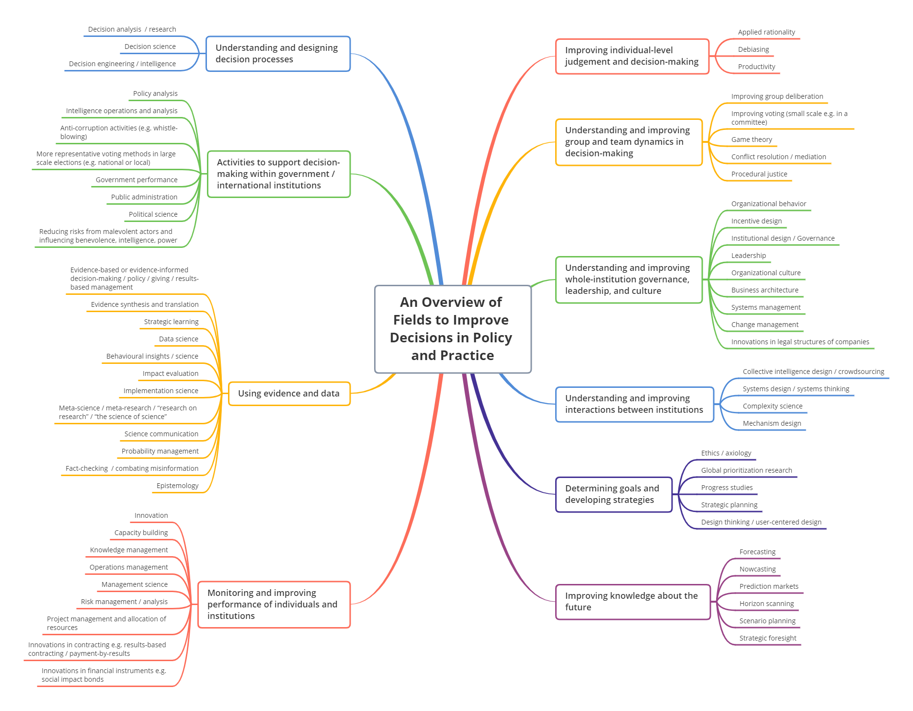

*This overview was initially developed by the Effective Institutions Project in May 2021 and has been lightly adapted by Maxime Stauffer and Konrad Seifert.*

At SI, we support international policy actors in dealing with uncertainty, complexity, time-pressure and extreme risks. Below is a compilation of fields and resources we draw from and that might be valuable for others. 

## Improving individual decision-making

Description: Helping individuals form accurate beliefs and make better choices. 

**[Applied rationality](https://en.wikipedia.org/wiki/Center_for_Applied_Rationality)**
Forming beliefs about the world as accurately as possible, for example, the work of the [Center for Applied Rationality](https://rationality.org/) or [ClearerThinking.org](https://www.clearerthinking.org/)

**[Debiasing](https://en.wikipedia.org/wiki/Debiasing)**
Explicit strategies to combat known cognitive biases such as base-rate neglect, anchoring, and planning fallacy. Debiasing interventions typically fall into one of three categories: training, nudges (or [choice architecture](https://en.wikipedia.org/wiki/Choice_architecture)), and incentives.

**Productivity**
Helping individuals (within institutions) get more, more important things done e.g. task management, scheduling, focus).

## Understanding and improving group and team dynamics

**[Improving group deliberation](https://en.wikipedia.org/wiki/Deliberation)**
The thoughtful weighing up of options prior to the group making a decision/voting.

**Improving voting (small scale e.g. in a committee)**
The promotion of particular voting methods which have beneficial properties such as better representing the “will of the people”.

**[Game theory](https://en.wikipedia.org/wiki/Game_theory)**
The study of strategic interaction between rational actors with divergent goals through a mathematical lens. Relevant for avoiding coordination failures.

**[Conflict resolution](https://en.wikipedia.org/wiki/Conflict_resolution)/mediation**
Facilitating the peaceful ending of conflict and retribution. 

**[Procedural justice](https://plato.stanford.edu/entries/justice/#ProcVersSubsJust)**
A concept from philosophy and law dealing with the design of procedures for decision-making and adjudication that can be accepted as just and legitimate by all participants.

## Understanding and improving institutional governance, leadership, and culture

**[Organizational behavior](https://en.wikipedia.org/wiki/Organizational_behavior)**
The study of human behavior in organizational settings, the interface between human behavior and the organization, and the organization itself. It includes the study of individuals and groups within organizations as well as organizations as a whole. Topics within organizational behaviour include decision-making, leadership, culture and employee motivation.

**[Incentive design](https://link.springer.com/referenceworkentry/10.1057%2F978-1-137-00772-8_693)**
Incentive design is a means of aligning the interests of an organization’s employees and owners or more broadly actors within a system with the interests of the designers of the system.

**[Institutional design](https://www.who.int/healthsystems/topics/financing/healthreport/36Institutional.pdf)/Governance**
Institutional design is the design of rules, such as legal and regulatory provisions, monitoring and enforcement mechanisms, incentives, and norms, to achieve particular aims.

**[Leadership](https://www.thebalancesmb.com/leadership-definition-2948275)**
Leadership is the art of motivating a group of people to act toward achieving a common goal. 

**[Organizational culture](https://en.wikipedia.org/wiki/Organizational_culture)**
A set of assumptions shared by employees within the same organisation that guide behaviour.

**[Business architecture](https://en.wikipedia.org/wiki/Business_architecture)**
Business architecture represents real-world aspects of a business, along with how they interact. It is developed by an interdisciplinary practice area focused on defining and analyzing concerns of what business does, how it does it, how it is organized, and how it realizes value. It is used to design competitive structures and processes, leverage existing strengths, and identify potential investment opportunities that advance the business's objectives and drive innovation.

**[Systems management](https://thebusinessprofessor.com/management-leadership-organizational-behavior/systems-theory-of-management)**
This approach to management recognises that all parts of an organisation are interrelated. It focuses on evaluating the system as a whole and understanding the impact of decisions on different parts of the organisation.

**[Change management ](https://en.wikipedia.org/wiki/Change_management)**
Change management involves activities to prepare, support, and help individuals, teams, and organizations in making organizational change.

**[Innovations in legal structures of companies](https://www.gov.uk/government/publications/legal-forms-for-social-enterprise-a-guide)**
The set-up of new legal structures of companies to facilitate a different focus than traditional maximisation profit for shareholders, in particular social or environmental objectives. Examples include cooperatives, community interest companies in the UK or [B Corps](https://bcorporation.uk/).

## Understanding and improving interactions between institutions

**Landscape analysis/Identifying gaps in an organizational landscape**
Landscape analysis focuses on mapping organizations and initiatives in a defined space of practice to subsequently identify gaps and opportunities for new projects or organizations.

**[Collective intelligence design](https://docs.google.com/document/d/1ehT4RSlprHdin6zWQ68SsuqUzjzgNn9jGaD1zJsPc3w/edit?usp=sharing)/crowdsourcing**
Collective intelligence design opens up the opportunity for people to contribute and work together on projects, often with the help of technology, to mobilise a wider range of information, ideas and insights. For example, Wikipedia crowdsources knowledge from thousands of contributors. 

**[Systems design](https://modus.medium.com/what-the-is-systems-design-e005c1e9fef8)/systems thinking**
Systems design takes a bird’s eye view of a system (of institutions and people) to understand how they interact, the roles they each play and identify gaps.

**[Complexity science](https://en.wikipedia.org/wiki/Complex_system)**
The study of complex systems. A system is complex if it has some of the following properties: nonlinearity, emergence, spontaneous order, adaptation, and feedback loops, among others. [Here](https://complexityexplained.github.io/) is a visual introduction.

**[Mechanism design](https://voxeu.org/article/nobel-prize-what-mechanism-design-and-why-does-it-matter)**
Mechanisms can be used to handle collective decision problems. A mechanism specifies how information can be communicated and the decision that will be taken conditional on those messages. For example, in an auction, potential buyers can communicate whether they are willing to pay a certain amount and the decision rule is that the item is awarded to whoever communicates the highest value. The work of the [RadicalxChange](https://www.radicalxchange.org/) social movement on e.g. quadratic voting and quadratic funding could be described as promoting better-designed mechanisms.

## Determining goals and developing strategy

**[Ethics](https://en.wikipedia.org/wiki/Ethics)/axiology**
Ethics is the branch of philosophy concerned with moral principles and values. Utilitarianism and consequentialism are examples of ethical theories.

**[Global prioritization research](https://80000hours.org/problem-profiles/global-priorities-research/)**
The field of global priorities research is about rigorously investigating what the most important global problems are, how we should compare them to each other, and what kinds of interventions best address them.

**[Progress studies](https://www.theatlantic.com/science/archive/2019/07/we-need-new-science-progress/594946/)**
A nascent intellectual movement promoted by Tyler Cowen and Patrick Collison “focused on understanding the dynamics of progress \[and]...the deeper goal of speeding it up.” “By ‘progress,’ we mean the combination of economic, technological, scientific, cultural, and organizational advancement that has transformed our lives and raised standards of living over the past couple of centuries.”

**[Strategic planning](https://en.wikipedia.org/wiki/Strategic_planning)**
A formal process, generally undertaken at the level of a whole organization or division, to identify goals and a realistic pathway to achieving them. Strategic plans frequently involve defining or revising the organization’s mission, vision, values, target audiences, and scope of activities, and typically cover a time horizon between three and 15 years. A [master plan](https://urban-regeneration.worldbank.org/node/51) is an analogous concept from urban planning.

**[Design thinking/user-centered design](https://www.interaction-design.org/literature/article/5-stages-in-the-design-thinking-process)**
Design thinking is a design methodology that provides a solution-based approach to solving problems. It approaches the problem by understanding the human needs involved, by re-framing the problem in human-centric ways, by creating many ideas in brainstorming sessions, and by adopting a hands-on approach in prototyping and testing.

## Improving knowledge about the future

**[Forecasting](https://en.wikipedia.org/wiki/Forecasting)**
Making predictions of the future based on past and present data and most commonly by analysis of trends. 

**[Nowcasting](https://en.wikipedia.org/wiki/Nowcasting_(economics))**
Predicting of the present or the very near future of a value (for example the weather tomorrow). It can also include the prediction of a very recent past state of a value (for example economic indicators are often determined only after a long delay and are subject to revision).

**[Prediction markets](https://en.wikipedia.org/wiki/Prediction_market)**
Prediction markets (also known as betting markets, political betting markets, predictive markets, information markets, decision markets, idea futures, event derivatives, or virtual markets) are exchange-traded markets created for the purpose of trading the outcome of events. The market prices can indicate what the crowd thinks the probability of the event is and can hence be used to give an indication of the likelihood of an event occurring. 

**[Horizon scanning](https://www.oecd.org/education/ceri/35393902.pdf)**
Horizon scanning is a technique for detecting early signs of potentially important developments through a systematic examination of potential threats and opportunities.

**[Scenario planning](https://en.wikipedia.org/wiki/Scenario_planning)**
Scenario planning maps out different scenarios to enable organisations to develop flexible long-term plans.

**[Strategic foresight](https://www.oecd.org/strategic-foresight/whatisforesight/)**
Strategic foresight involves considering multiple alternative futures and their implications. It doesn’t seek to offer a definitive answer about what the future will hold but aims to expand the range of plausible developments to allow for planning.

## Monitoring and improving the performance of individuals and institutions

**[Innovation](https://en.wikipedia.org/wiki/Innovation)**
Innovation is the practical implementation of ideas that result in the introduction of new goods or services or improvement in offering goods or services.

**[Capacity building](https://en.wikipedia.org/wiki/Capacity_building)**
Capacity building is the process by which individuals and organizations obtain, improve, and retain the skills, knowledge, tools.

**[Knowledge management](https://en.wikipedia.org/wiki/Knowledge_management)**

Knowledge management is the process of creating, sharing, using and managing the knowledge and information of an organization. These efforts focus on the management of knowledge as a strategic asset and on encouraging the sharing of knowledge.

**[Operations management](https://en.wikipedia.org/wiki/Operations_management)**

Operations management is an area of management concerned with designing and controlling the process of production and redesigning business operations in the production of goods or services. It involves the responsibility of ensuring that business operations are efficient in terms of using as few resources as needed and effective in terms of meeting customer requirements.

**[Management science](https://en.wikipedia.org/wiki/Management_science)**

Management science involves developing and applying models and concepts that may prove useful in helping to illuminate management issues and solve managerial problems. The models used can often be represented mathematically, but sometimes computer-based, visual or verbal representations are used as well or instead. 

**[Risk management/analysis](https://en.wikipedia.org/wiki/Risk_management)**

The process of identifying, assessing and mitigating threats to an institution achieving its aims.

**[Project management](https://en.wikipedia.org/wiki/Project_management)** and allocation of resources

Project management is the process of leading the work of a team to achieve goals and meet success criteria at a specified time. The primary challenge of project management is to achieve all of the project goals within the given constraints.

**Innovations in contracting e.g. [results-based contracting](https://pwc.blogs.com/deals/2015/08/outcome-based-contracts.html#:~:text=Outcome%2Dbased%20contracts%20are%20results,measurable%20performance%20standards%20and%20requirements.)/payment-by-results**

The design of contracts to achieve a particular aim. For example, in results-based contracting, typically at least a portion of a contractor’s payment, contract extensions or contract renewals is tied to the achievement of specific, measurable and independently verifiable performance standards and requirements.

**Innovations in financial instruments e.g. [social impact bonds](https://golab.bsg.ox.ac.uk/the-basics/impact-bonds/#:~:text=Impact%20bonds%20(IBs)%20are%20outcomes,if%20these%20outcomes%20are%20achieved.)**

The set-up of new financial instruments to achieve a particular aim. Examples include social impact bonds, which use private funding from investors to cover the upfront capital required for a provider to set up and deliver a service. The service is designed to achieve measurable outcomes specified by the commissioner. The investor is repaid only if these outcomes are achieved.

## Using evidence and data

**[Evidence-based or evidence-informed decision-making](https://en.wikipedia.org/wiki/Evidence-based_policy)/policy/giving/results-based management**
Decisions based on or informed by, rigorously established objective evidence.

**[Evidence synthesis and translation](https://gspi.ch/activities/the-art-of-brokering-knowledge-or-how-to-align-the-stars/)**
Evidence synthesis involves reviewing the evidence on a particular topic (commonly an intervention) and combining the findings in order to draw a conclusion on what the evidence says overall about that topic. The translation of evidence involves explaining the methodology and findings of a research paper/project in lay terms.

**[Strategic learning](https://www.evaluationinnovation.org/?s=&topic=strategic-learning)**
Using evaluation to help organizations or groups learn quickly from their work so they can learn from and adapt their strategies. It means integrating evaluation and evaluative thinking into strategic decision making and bringing timely data to the table for reflection and use.

**[Data science](https://en.wikipedia.org/wiki/Data_science)**
Data science extracts knowledge and insights from structured and unstructured data, and applies knowledge and actionable insights from data across a broad range of application domains. It is the “[discipline of making data useful](https://hackernoon.com/what-on-earth-is-data-science-eb1237d8cb37)”.

**[Behavioral insights/science](https://www.who.int/our-work/science-division/behavioural-insights)**
Behavioral insights is a term used to refer to efforts made to make programmes and policies more effective by applying a more accurate and evidence-based understanding of how people behave and make decisions. This often involves drawing from cognitive science, psychology and behavioural economics, as well as generating new evidence by testing interventions informed by behavioural science (including ‘nudges’). 

**[Impact evaluation](https://www.betterevaluation.org/en/themes/impact_evaluation)**
An impact evaluation provides information about the impacts (positive and negative; intended and unintended) of an intervention (a project/program/policy) on outcomes. 

**[Implementation science](https://www.ncbi.nlm.nih.gov/pmc/articles/PMC4573926/)**
The study of methods to promote the systematic uptake of research findings and other evidence-based practices into routine practice, and, hence, to improve the quality and effectiveness of practice / a programme.

**[Meta-science](https://en.wikipedia.org/wiki/Metascience)/meta-research/“research on research”/“the science of science”**
Metascience is the use of scientific methodology to study science itself. It uses research methods to study how research is done and where improvements can be made.

**[Science communication](https://en.wikipedia.org/wiki/Science_communication)**
Science communication involves informing, educating, raising awareness of science-related topics, and increasing the sense of wonder about scientific discoveries and arguments. [Here](https://downloads.hindawi.com/scicomm-guide.pdf) is a comprehensive guide for science communication. 

**[Probability management](https://en.wikipedia.org/wiki/Probability_management)**
The calculation and communication of uncertainties, in particular calculating over ranges instead of using averages.

**[Fact-checking](https://en.wikipedia.org/wiki/Fact-checking) /combating misinformation**
Fact-checking seeks to verify the correctness of reporting. It aims to encourage truthful and accurate reporting, as well as correct inaccurate reporting.

**[Epistemology](https://en.wikipedia.org/wiki/Epistemology)**
Epistemology is a branch of philosophy concerned with how knowledge is constructed and what constitutes a justifiable belief. 

## Activities to support decision-making within governmental institutions

**[Policy analysis](https://en.wikipedia.org/wiki/Policy_analysis)**
Policy analysis uses both qualitative methods and quantitative methods to evaluate policy options with respect to policy goals. A common practice is to define the problem and evaluation criteria; identify and evaluate alternatives; and recommend a certain policy accordingly. 

**[Intelligence operations and analysis](https://www.st-andrews.ac.uk/careers/exploring-your-future/career-options/a-z/intelligence-public-sector/)**
Intelligence involves the gathering and analysis of information, for example, for national security.

**[Anti-corruption](https://en.wikipedia.org/wiki/Anti-corruption) activities**
Anti-corruption comprises activities that oppose or inhibit corruption (e.g. whistle-blowing).

**More representative voting methods in large scale elections (e.g. national or local)**
The aim being to better represent the “will of the people” and to avoid bad outcomes relating to the voting method itself e.g. tactical voting rather than voting for one’s true preference. For example, see the work of the [Centre for Election Science](https://electionscience.org/).

**[Government performance](https://www.instituteforgovernment.org.uk/our-work/whitehall-monitor/measuring-performance)**
How well a government is doing as measured by external actors; by the government having its own performance framework; by comparing the government with other countries or by asking the public what they think.

**[Public administration](https://www.britannica.com/topic/public-administration)**
Public administration is the implementation of government policies. Specifically, it is the planning, organizing, directing, coordinating, and controlling of government operations.

**[Political science](https://en.wikipedia.org/wiki/Political_science)**
Political science is a social study concerning the allocation and transfer of power in decision making, the roles and systems of governance including governments and international organizations, political behaviour and public policies.

**[Reducing risks from malevolent actors](https://forum.effectivealtruism.org/posts/4oGYbvcy2SRHTWgWk/improving-the-future-by-influencing-actors-benevolence#fn-7AHacdyNseg65NHnB-1) and [influencing benevolence, intelligence, power](https://forum.effectivealtruism.org/posts/4oGYbvcy2SRHTWgWk/improving-the-future-by-influencing-actors-benevolence#fn-7AHacdyNseg65NHnB-1)**
Key institutions are likely to have more of the impact we’d like if leaders are benevolent and intelligent.

## Understanding and designing decision processes

**[Decision analysis/research](https://cdr.leeds.ac.uk/about/)**
Decision research focuses on the way individuals, groups and organisations make decisions. It involves perspectives that are:

* Descriptive – why and how decisions are made the way they are
* Normative – how decisions should be made in some ideal sense
* Prescriptive – how can decision making be made more effective.

**Decision science**
Decision science is a mostly normative discipline, focusing on how decisions should be made in some ideal sense (particularly defined as expected utility). 

**[Decision engineering](https://timvangelder.com/2015/01/07/what-is-decision-engineering/)/intelligence**
Decision engineering/intelligence is the application of relevant knowledge to design, build, maintain, and improve systems for making decisions. Decision intelligence is a variant of decision engineering that has closer intellectual ties to data science and machine learning.