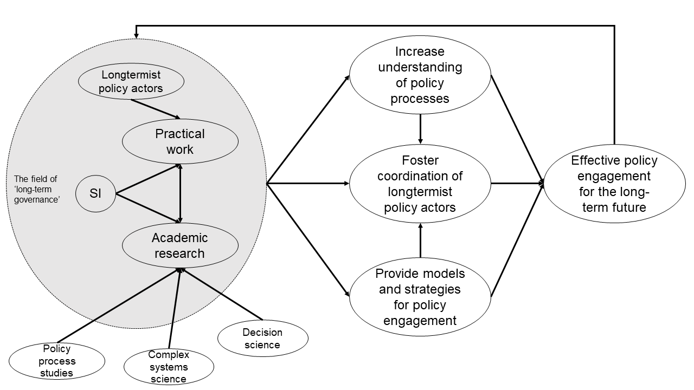

## Introduction

Part of our work at the Simon Institute (SI) is to conduct research on how to integrate the interests of future generations into policymaking processes. We call this field *long-term governance*. 

The study of long-term governance builds upon existing fields. The most important of these include (1) public policy/policy process studies (e.g. [Sabatier & Weible, 2018](https://www.taylorfrancis.com/books/edit/10.4324/9780429494284/theories-policy-process-christopher-weible-paul-sabatier)); (2) political philosophy and representations of future generations (e.g. [Gonzalez-Ricoy and Gosseries, 2016](https://global.oup.com/academic/product/institutions-for-future-generations-9780198746959?cc=ch&lang=en&)); (3) political behavior and decision-making (e.g. [Jones et al., 2005](https://www.cambridge.org/core/journals/perspectives-on-politics/article/abs/politics-of-attention-how-government-prioritizes-problems/C5928D9EEE880A176C3EC05D7C087DC5)); and (4) governance and institutional fit (e.g. [Young, 2009](https://www.jstor.org/stable/26268302?seq=1#metadata_info_tab_contents)). 

By governance, we mean not just the government of a state but a wider decision-making ecosystem of individuals and organizations. Most of our research focuses on institutions ranging from international and regional organizations (e.g. the WHO and other UN organizations, the European Commission) to national governments, academic institutions, and advocacy groups wishing to inform policymaking for the long-term future. 

In conducting this research, we make choices about the questions we ask, modeling assumptions we make, which literature to rely on, etc. **In this short piece, we make explicit the underlying beliefs that inform these decisions. By doing so, we hope to explain our approach, invite constructive criticism and live up to our standard of reasoning transparency.** 

For context, we will start with an overview of our approach, before spelling out five crucial underlying beliefs. We conclude by outlining our current research directions. Figure 1 summarizes our research approach. 

1. [Overview of SI’s research approach](/blog/post/building-the-field-of-long-term-governance-si%E2%80%99s-research-approach/#overview-of-sis-research-approach)
2. [Building a well-coordinated longtermist policy community](/blog/post/building-the-field-of-long-term-governance-si%E2%80%99s-research-approach/#building-a-well-coordinated-longtermist-policy-community)
3. [Understanding policymaking processes is useful](/blog/post/building-the-field-of-long-term-governance-si%E2%80%99s-research-approach/#understanding-policymaking-processes-is-useful)
4. [Understanding policymaking processes is tractable](/blog/post/building-the-field-of-long-term-governance-si%E2%80%99s-research-approach/#understanding-policymaking-processes-is-tractable)
5. [Improving mental models for more effective engagement](/blog/post/building-the-field-of-long-term-governance-si%E2%80%99s-research-approach/#improving-mental-models-for-more-effective-engagement)
6. [Knowledge foundations](/blog/post/building-the-field-of-long-term-governance-si%E2%80%99s-research-approach/#knowledge-foundations)
7. [Current research directions](/blog/post/building-the-field-of-long-term-governance-si%E2%80%99s-research-approach/#current-research-directions-and-progress)

## Overview of SI’s strategy

We conduct our research because we think the long-term future matters morally. To improve the future, policymaking is an important form of coordination with tremendous potential. 

To leverage policy processes, we aim to systematically improve our understanding of policy change dynamics (see [section 3](/blog/post/building-the-field-of-long-term-governance-si%E2%80%99s-research-approach/#understanding-policymaking-processes-is-useful) and [4](/blog/post/building-the-field-of-long-term-governance-si%E2%80%99s-research-approach/#understanding-policymaking-processes-is-tractable)). Through the synthesis of relevant literature, we identify insights about the dynamics of policy processes and their implications for embedding concern for future generations within them. 

Additionally, we consider it critical to integrate an understanding of the day-to-day realities faced by policy professionals into our research and recommendations for policy engagement strategies (see [section 6](/blog/post/building-the-field-of-long-term-governance-si%E2%80%99s-research-approach/#knowledge-foundations)). [SI's other activities](/projects/) inform our research - working directly with international civil servants, diplomats, academics, and various other actors to foster a community of practice for long-term governance (see also [Rojas et al., 2021](https://www.cser.ac.uk/news/new-report-pathways-linking-science-and-policy-fie/)). 

Building on the above, we aim to improve the effectiveness of longtermist policy efforts by (1) equipping policy actors who care for future generations with better strategies and mental models for engaging in complex policy processes (see [section 5](/blog/post/building-the-field-of-long-term-governance-si%E2%80%99s-research-approach/#improving-mental-models-for-more-effective-engagement)), and by (2) strengthening coordination between these actors (see [section 2](/blog/post/building-the-field-of-long-term-governance-si%E2%80%99s-research-approach/#building-a-well-coordinated-longtermist-policy-community)). 

Unlike other think tanks, we do not develop concrete policy recommendations, e.g. on extreme climate change, AI governance or biosecurity. Instead, our research aims to inform the strategy and activities of actors, individuals, or groups who care about the long-term future and engage with policy processes. 

In the following, we explain some key assumptions underlying our research approach. 

## Building a well-coordinated longtermist policy community

We believe that **building a well-coordinated longtermist policy community is important to embedding future generations within existing policy ecosystems.** 

Coordination increases the collective impact potential of the longtermist policy community. It can improve both local as well as global policymaking through, for example, learning across contexts, building networks of allies, or influencing policymaking at multiple levels of governance (e.g. see [Mavrot & Fritz, 2018](https://www.ingentaconnect.com/content/tpp/pap/2018/00000046/00000003/art00003)). Other benefits from coordination include placing aligned talent in policy networks; individually intractable reforms of policymaking institutions; creating new organizations where the need arises; or avoiding their creation where they would pose unjustified risks. 

Longtermist policy actors are heterogeneous - they work at different geographical scales, on different issues, have different strategies, and pursue, in part, different goals. These actors might be inside of policy institutions (such as the [UN Office for Disarmament Affairs ](https://www.un.org/disarmament/)or the [WHO’s science division](https://www.who.int/our-work/science-division)) or outside of policy institutions (such as think tanks or academic institutes working on questions concerning the long-term future). Some actors work explicitly and exclusively on improving the long-term future (such as the [Future of Humanity Institute](https://www.fhi.ox.ac.uk/), the [Center for Security and Existential Risk](https://www.cser.ac.uk/), the [Future of Life Institute](https://futureoflife.org/)), while others are long-term oriented or functionally relevant to long-term governance (such as the [Nuclear Threat Initiative](https://www.nti.org/), the [Intergovernmental Panel for Climate Change](https://www.google.com/search?q=IPCC&client=firefox-b-d&ei=G3qrYIGaGLiO9u8P9fmEoAk&oq=IPCC&gs_lcp=Cgdnd3Mtd2l6EAMyDQguEMcBEK8BEEMQkwIyBQgAEJECMgQIABBDMgQIABBDMgIIADICCAAyAggAMgIIADICCAAyAggAOggIABCxAxCDAToLCC4QsQMQxwEQowI6BQgAELEDOggILhCxAxCDAToLCC4QxwEQowIQkQI6BwgAELEDEEM6BAgAEAo6CAguEMcBEK8BUPmZAVjhnQFgnJ8BaABwAHgAgAHKAogB5waSAQcxLjQuMC4xmAEAoAEBqgEHZ3dzLXdpesABAQ&sclient=gws-wiz&ved=0ahUKEwjBk9K_iOLwAhU4h_0HHfU8AZQQ4dUDCA0&uact=5)). Despite their differences, all of these actors have some goals, interests, and characteristics in common, building the basis for fruitful coordination. 

Given their shared mission, different longtermist policy actors are inevitably interconnected; actions taken by one actor can impact other actors by broadening, narrowing, or altering their option space. Thus, increased bandwidth between longtermist policy actors is critical in reducing downside risk, e.g. from inconsiderate actions harming the impact potential of the community at large. 

Fostering a strong longtermist policy community requires a common vocabulary, shared norms (e.g. of [considerateness](https://www.centreforeffectivealtruism.org/blog/considering-considerateness-why-communities-of-do-gooders-should-be/)), and a shared understanding of policy processes anchored in evidence. This creates an environment conducive to collective truth-seeking, where interactions are based on good faith and foster mutual understanding, where different yet complementary perspectives can be explored effectively, and where the likelihood of miscommunication - overt or inconspicuous - is reduced. Academia is perhaps the most prominent, albeit imperfect, example of a global community where a shared vocabulary, norms, and understanding have been critical to success. Similarly, coordinated policy action requires high communication bandwidth to build trust among all actors. 

We want the longtermist policy community to exist as long as necessary, potentially for decades, centuries, and beyond. This is because policy change - be it the implementation of policies, the reformation of institutions, or the shaping of narratives - takes time. Even if all policymaking institutions were suddenly aligned with the mission of preserving the potential of the long-term future, we would still face difficult empirical and practical questions. To have lasting impact, the community needs to be able to prevent value drift, mitigate harm, learn from policy failures, build a well-functioning talent pipeline and manage its collective knowledge (e.g. to avoid losing it when one generation of policy actors gets replaced by the next). 

It makes sense to strengthen coordination when a community is taking shape. The current longtermist policy community is insufficiently organized and has no established best practices for engaging in policymaking for the long term. Our work contributes to the formation of a strong longtermist policy community. 

## Understanding policymaking processes is useful

An important underlying belief that guides our research is that **the ability to effectively improve long-term governance depends on our understanding of policymaking processes.**

Policymaking deals with [wicked problems](https://en.wikipedia.org/wiki/Wicked_problem) and [bounded rational actors](https://en.wikipedia.org/wiki/Bounded_rationality). In other words, it is common in policymaking that no optimal solution to a policy problem is known, or if there is, the path to achieving it is uncertain. How do we constructively deal with this puzzle?

Every type of policy work - whether it is advocacy, expert advice, or process improvement - requires us to engage in *policymaking processes*. By policymaking processes, we refer to the complex order that results from the interactions of bounded-rational, heterogeneous policy actors which drive and determine policy change. These actors include politicians, public officials, policy scholars, advocates, politically active citizens, and more. They differ, among others, in their goals and motivations, strategies of engagement, and resources. The myriad of interactions and decisions between and by policy actors are shaped by an institutional context and result in the formulation, implementation, adoption, and evaluation of policies. 

The study of policymaking processes transcends disciplines. It builds upon, for example, political science, psychology of decision-making, and computational social sciences. Our research seeks to improve the long-term future through two main pathways: (1) improving policymaking processes as a robust way of improving policymaking outcomes in general; (2) improving the effectiveness of longtermist policy actors by, for example, identifying effective strategies of engagement, facilitating policy learning and calibrating expectations about the workings of policymaking. 

So far, this type of research has been primarily descriptive. It is well suited to describe how policymaking processes work and often does not make the additional step of providing solutions that help to overcome obstacles. Therefore, it is yet to be proven whether and to what extent future work in this space will be able to transcend this limitation, producing robust insight for reforming policymaking. 

Even if one accepts that understanding policymaking processes is useful in principle, one might wonder whether the identification of more effective engagement strategies depends on *further* understanding of policymaking processes. We do not yet have a clear answer to when a marginal improvement in one’s understanding of policy ceases to be worthwhile, or how one could tell conclusively. However, given recent [methodological advances](https://science.sciencemag.org/content/369/6507/1060) that open new avenues to understanding the complex nature of social phenomena (including policy processes), we believe that we have not yet reached the point at which additional understanding ceases to be worth seeking. Furthermore, the work pursued by SI involves direct engagement with policy actors. While no guarantee on its own, this does provide SI with a constant stream of feedback about whether additional insights into the functioning of policy processes continue to be useful, and when they might cease to be. 

## Understanding policymaking processes is tractable

Assuming that increasing our understanding of policymaking processes is useful, is it also tractable?

We believe so. In essence, the reason why is that **policymaking, while messy, does depict structures that can be studied and understood**. 

Anywhere in the world, policymaking processes consist of many individuals with different affiliations and goals who interact and form groups to influence decisions made by governments or international organizations. These network dynamics do not occur in a vacuum but within an institutional setting, with laws and organizational structures that guide behavior. This process - many individuals interacting in a constrained environment - can be formally described as a complex system. 

Accordingly, we view policymaking as a complex system; a system that is neither simple, nor completely random, but depicts organized complexity (see [this handbook](https://www.elgaronline.com/view/edcoll/9781782549512/9781782549512.xml) for an academic treatment of why this lens is useful). It follows that there are recurrent patterns and mechanisms; for example, related to how policy actors interact, how ideas spread, how attention is being allocated, how policies are adopted, how policy networks form, and how they change over time. The view we adopt also suggests a need to unpack policymaking beyond the logic of (linear) input-output and beyond what is typically done under the banner of policy analysis (i.e. the sole study of policy outcomes). 

In fact, there already exist concrete examples of regularities in policymaking. Examples include systematic reviews on the [strategies and traits of policy entrepreneurs](https://onlinelibrary.wiley.com/doi/abs/10.1111/psj.12339) (i.e. policy actors who are more influential than others) and the [incremental and punctuated dynamics of policy change](https://onlinelibrary.wiley.com/doi/abs/10.1111/ropr.12283). This means that it is possible to build a solid understanding of policymaking processes *beyond context-specific knowledge* by identifying common patterns that are found in policymaking across the globe. Our research aims to identify such recurrent patterns and explore their implications for long-term governance. This is not to say that context-specific knowledge won’t still play an important role in fine-tuning an actor’s strategy. 

Within our goal of better understanding policy processes, most of our work currently relates to agenda-setting and decision-making processes. Based on our current understanding, we believe that, at this point in time, these are the most important processes to understand and strengthen in view of improving the long-term future. Agenda-setting is relevant because the long-term future is highly neglected in today’s policymaking. Decision-making processes are central because decision-making (including long-term policymaking) boils down to the interaction of individuals or groups. Understanding and improving the current shortcomings of these decision-making processes is a robust way to improve our capacity for long-term policymaking. 

## Improving mental models for more effective engagement

We believe that **equipping policy actors with more accurate mental models and heuristics** about how to engage in the complex dynamics of policymaking is **an effective way to strengthen the capabilities of policy actors**. 

Policy actors (including ourselves) are bounded-rational. This is to say that not only are the decision problems we all face ill-defined but we also have limited resources to address them (e.g. attention, cognitive capacity). This situation is further aggravated by the fast-paced nature of policy work. As a result, we all rely on heuristics, implicit beliefs, and intuitions when deciding how best to act. 

Unfortunately, we have reasons to believe that the intuitions and heuristics policy actors tend to rely on are not well calibrated to the complex nature of today’s policymaking and the global reach of its consequences. For example, based on what we have learned from research in psychology and decision-making over the last decades, peoples’ intuitions when interacting with complex systems are often miscalibrated due to the fact that they offer relatively weak, slow, or noisy feedback loops for learning. This is part of what makes working in policy particularly challenging and, at times, frustrating. We want to influence messy processes but are inevitably limited in navigating them.  

We cannot change the facts that we all are bounded-rational and that the decision problems are ill-defined. However, we can improve decisions in policymaking by providing better calibrated mental models (e.g. simple models of risk or event distributions) and heuristics (e.g. wisdom of the crowd versus contextualized information), and by helping policymakers better understand which heuristics to apply when and how. This constitutes a realistic approach to supporting policymakers in making better decisions in the face of complexity, uncertainty, and time constraints. 

## Knowledge foundations

Finally, we will discuss what bodies of knowledge our research tends to build upon, and why. 

Despite the various fallibilities of academia, it offers a wealth of knowledge that our research builds upon. In order to make sure our research addresses important and unresolved questions, we need to know where the current literature on, e.g. policymaking processes or decision-making support is at. Research synthesis does not only provide a solid knowledge basis to build on for ourselves but can also provide direct value to the field of long-term governance and policy practitioners. 

In particular, we currently build primarily on three bodies of knowledge (which might change in the future). These are (1) policy process studies, (2) complex systems science, and (3) decision science. 

(1) *Policy process studies* covers many key topics concerning long-term governance, such as the nature of policy change, institutions for future generations, policy advocacy, etc. This literature contains theoretical as well as empirical work, the accumulation of which can lead to insights into how policymaking functions, such as exemplified by [this paper](https://onlinelibrary.wiley.com/doi/full/10.1111/psj.12000). Other seminal pieces of work that inspire our thinking include [comparative analyses](https://doi.org/10.1111/j.1540-5907.2009.00405.x) on policy change, [collections of mechanisms](https://global.oup.com/academic/product/institutions-for-future-generations-9780198746959?cc=ch&lang=en&) to represent future generations, or [studies of policy networks](https://www.cambridge.org/core/books/multimodal-political-networks/43EE8C192A1B0DCD65B4D9B9A7842128). 

(2) *Complex systems science* includes theoretical and empirical work on studying recurrent patterns across complex systems. It includes theories and methods to study complex networks, emergent dynamics, and nonlinear effects. An excellent overview of the theory and formalization of complex systems is provided [in this book](https://oxford.universitypressscholarship.com/view/10.1093/oso/9780198821939.001.0001/oso-9780198821939). 

(3) *Decision science* was initially pioneered by [Herbert Simon](https://pubsonline.informs.org/doi/abs/10.1287/orsc.2.1.125), SI’s figurehead, and includes work on decision-making in the face of [catastrophes](https://doi.org/10.1007/s10640-016-0033-3), [heavy-tailed risks and preparedness](https://doi.org/10.1111/ajpy.12237), [complexity](https://www.frontiersin.org/articles/10.3389/fpsyg.2017.01153/full#h3), and key theories concerning information processing such as [ecological](https://doi.org/10.1146/annurev-psych-120709-145346) and [computational rationality](https://science.sciencemag.org/content/349/6245/273.abstract).  

SI combines theoretical and empirical research with practical work within policy networks. We believe that practically relevant insights emerge from one informing the other. Our practical work allows us to generate new data and test theories and models empirically. Among others, we are inspired by the approach advocated for in this [paper](https://journals.sagepub.com/doi/10.1177/0144739414532284), emphasizing the importance of integrating theoretical knowledge with the experience of practitioners. 

Finally, in order to make sure our research outputs attain adequate qualitative standards, we seek feedback from various sources, among them the academic peer-review process.

## Current research directions and progress

Having discussed the underlying beliefs that guide our research, we provide an overview of research directions currently pursued by SI.

Throughout 2021 and 2022, we are exploring the following six research questions:

1. What determines whether institutions are fit for the long-term future? Subsequently, what is the current fit of institutions worldwide and in specific contexts? What are avenues of improvement? 
2. What institutional reforms allow for a due representation of future generations in policymaking, and improve our ability to govern intergenerational global public goods? 
3. How can the science-policy interface be strengthened for the long-term future? 
4. What do the dynamics and mechanisms of policy change tell us about embedding future generations in policymaking? 
5. What can we learn from psychology and related fields about political decision-making and how policy actors make decisions with respect to the long-term future?
6. What can we learn from the advocacy and lobbying literature for effective longtermist advocacy?

You can follow our progress here:

* \[Working paper] [Policymaking for the Long-term Future: Improving Institutional Fit](/project/public-policy-making-longterm-future/)
* \[preprint] [Computational Policy Processes](/project/computational-policy-process-studies/) 
* \[Blog post] [Setting expectations for extreme risk mitigation through policy change](/blog/post/setting-expectations-for-extreme-risk-mitigation-through-policy-change/)

**Support us or collaborate with us**

If you are interested in our work and would like to support or collaborate with us, please, do [get in touch](/get-involved/#get-in-touch)!

*Photo credit: seedlings by [Ryan Lange](https://unsplash.com/@ryanlange?utm_source=unsplash&utm_medium=referral&utm_content=creditCopyText).*
