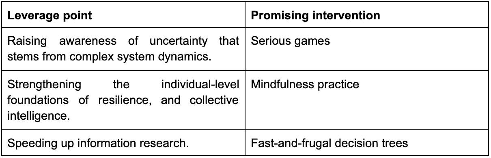

*What is it like to be a policymaker during the COVID-19 pandemic?* 

*What might it be like during the next pandemic or another global crisis?* 

*How can we improve policymakers' capacity to effectively navigate and prevent complex global crises?* 

These are some of the questions that motivated the analysis that led to this report.

- - -

> “Especially early in the pandemic, how much time did you have to make decisions? Are we talking about weeks or days?”

> “Never weeks. Ever. I think it's very, very complicated. You have to be able to cope with digesting information very fast \[....] you have to prioritize a lot and only act on the most pressing issues. \[...] you have to let go of what is not a priority, which isn't so complicated to do, but then you have a whole range in between what is not a priority and is quite clear and what would be nice to have.”

- - -

The report focuses on the topics of information overload and uncertainty—psychological challenges relevant to navigating any complex policy issue. It’s based on twenty-three interviews with national, international, and regional policy professionals, and establishes barriers and facilitators that impact individuals as they handle information overload and uncertainty. Building on that, the report suggests leverage points and concrete interventions to support policymakers’ decision-making capacity in overwhelming and unpredictable times. 

Three leverage points were identified, along with three promising interventions:

[Click here to read the full report](https://drive.google.com/file/d/1qkiEHpmFl4K2pXGJz3QnXKyoiKRWqrWJ/view?usp=sharing) by Elias Kock.