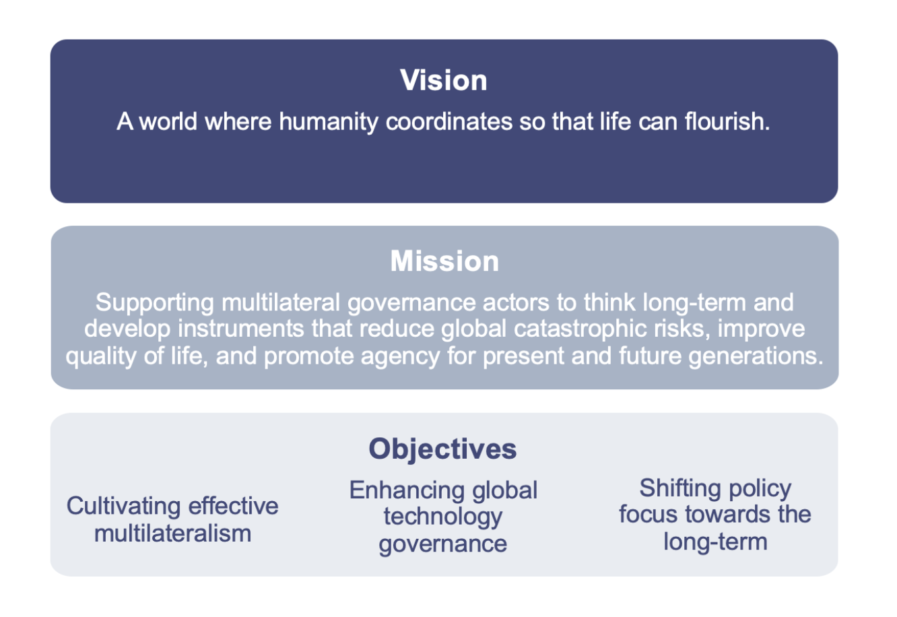

## Executive Summary

Until the end of 2025, SI will focus on improving the multilateral system’s capacity for the governance of rapid technological change, with a specific focus on AI. We see our **strategic context** as follows:

* The world is likely moving from a unipolar to a bipolar or multipolar order. Multilateral governance processes are contested via north-south tensions, tensions between the US and China are increasing, and private companies are increasingly providing global public goods.
* AI progress is inducing new policy challenges and exacerbating existing ones. Heightened public awareness of AI will amplify political discourse and increase the number of national, regional, multilateral, and private-sector AI governance processes being pursued, making multilateral policy coherence increasingly crucial.
* SI is a promising young organization facing a stress test. It has built expertise, credibility, infrastructure and networks to substantially contribute to multilateral frontier tech governance. Many funders have announced reductions in their giving due to economic uncertainty, while AI governance is gaining popularity amongst philanthropists. 

Given this context, our **priorities and goals** are to:

1. Boost the multilateral system’s ability to prioritize, discuss and deploy solutions to reduce risks and maximize benefits from transformative technological advances;

   * 1.1. Increase national demand for measured international action.
   * 1.2. Support tech governance processes in leading international organizations.
   * 1.3. Foster exchange and action within the multilateral tech governance system.
2. Advise national and non-governmental actors working on tech governance questions to act and communicate in ways that increase the likelihood of multilateral progress; and

   * 2.1. Enhance civil society engagement in multilateral processes.
   * 2.2. Contribute to the development of effective multi-stakeholder bodies.
   * 2.3. Boost national awareness of multilateral affairs for international coherence.
3. Boost SI’s sustainability and operations.

   * 3.1. Raise between 2.6MM-5.2MM CHF from a diverse set of funders.
   * 3.2. Strengthen and grow the SI workforce to ~10 full-time employees.
   * 3.3. Enhance SI’s operations, governance, and knowledge management.

Through these activities, we hope to contribute to building governance systems that are fit for the 21st century.

## Introduction

The SI Strategy Implementation Plan is established every 2 to 3 years to implement the SI Strategy and the objectives outlined therein. It empowers SI to plan and take more focused actions in response to the broader global context and anticipated developments during those specific time frames.

The Priorities, Goals and Projects outlined in the Strategy Implementation Plan are reviewed regularly throughout its time frame to guide resource allocation and take into account any contextual changes. Progress is tracked and measured through the SI Monitoring, Evaluation and Learning plan. 

## Terminology

* **Implementation plan:** Our 2 to 3-year action roadmap.
* **Short-term strategic context:** Current trends in issues and governance shaping our priorities in the next 2-3 years.
* **Priorities:** Key focus areas for upcoming years.
* **Goals:** Desired outcomes within each priority.
* **Projects:** Time-bound sets of deliverables (outputs) that aim to achieve goals; can span multiple priorities.
* **Finances:** Budget (lower and upper bound expenses to deliver the plan)
* **Monitoring, evaluation and learning plan:** Our process to monitor, assess, and adapt.

## Overview of SI’s full planning structure

## Timeframe

June 2023 to the end of 2025.

## Short-term strategic context

To define our priorities, we analyze the current short-term strategic context to identify key developments that shape SI and its environment. These developments occur on a short timescale, from the last \~3 years to the next \~5 years. Key implications for SI are in italics.

<table>
  <tr>
   <td colspan="2" ><strong>Global governance context</strong>
   </td>
  </tr>
  <tr>
   <td><strong>1. The world is likely moving from a unipolar to a bipolar or multipolar order.</strong>
   </td>
   <td> 
<ul>
 
<li>There are risks associated with transitioning from one order to another, such as heightened conflict and exacerbated inequalities.
 
<li>The next few years will likely be less stable, leading to more nationalism and lower trust. 
 
<li><em>Unstable geopolitics requires increased trust and deeper understanding of global risks, especially as instability can amplify risk.</em>
</li> 
</ul>
   </td>
  </tr>
  <tr>
   <td><strong>2. Multilateral governance processes are contested via north-south tensions.</strong>
   </td>
   <td> 
<ul>
 
<li>When it comes to technology, populations around the globe are exposed to risks, while benefits remain unequally distributed.
 
<li>Effective dialogue between China, the EU, the US and low and middle-income countries (LMICs) will be needed for successful technology governance.
 
<li>The diplomatic missions of LMICs may lack both the capacity and will to participate in discussions on risk governance (e.g. of new technologies such as AI), due to competing priorities, a lack of resources, and reasonable skepticism of good intentions. 
 
<li><em>Greater efforts should go towards empowering LMIC engagement in multilateral tech governance processes, fostering the development of their expertise, and actively involving them in decision-making. </em>
</li> 
</ul>
   </td>
  </tr>
  <tr>
   <td><strong>3. Tensions between the US and China are increasing.</strong>
   </td>
   <td> 
<ul>
 
<li>National security issues may dominate global narratives in the years to come.
 
<li>There may be lower trust to achieve change at the global level.
 
<li><em>Additional opportunities for dialogue and coordination are required to avoid irresponsible races in the deployment of poorly understood technologies. </em>
</li> 
</ul>
   </td>
  </tr>
  <tr>
   <td colspan="2" ><strong>Technological change and governance context</strong>
   </td>
  </tr>
  <tr>
   <td><strong>4. AI progress is exacerbating existing challenges and inducing new ones.</strong>
   </td>
   <td> 
<ul>
 
<li>Technological adoption is speeding up faster than society and governments adapt, putting the governance of global public goods into private hands.
 
<li>We’re seeing growing convergence between key challenges, such as between AI and climate, AI and nuclear, and AI and biotechnology.
 
<li><em>The speed of tech development combined with the complexity of its effects necessitates political approaches grounded in agility. </em>
</li> 
</ul>
   </td>
  </tr>
  <tr>
   <td><strong>5. Heightened public awareness will amplify political discourse.</strong>
   </td>
   <td> 
<ul>
 
<li>There is growing debate around the issues under point 4.
 
<li>As AI governance gains traction, more stakeholders will compete for attention in political discourse on AI.
 
<li><em>There is a need to improve the baseline understanding of frontier R&D within the tech governance ecosystem to avoid misinformation, polarization and dilution.</em>
</li> 
</ul>
   </td>
  </tr>
  <tr>
   <td><strong>6. The number of private, national, regional and multilateral AI governance processes are increasing.</strong>
   </td>
   <td> 
<ul>
 
<li>There is growing political pressure to tackle the issues under point 4.
 
<li>As this pressure grows, policymakers are becoming more focused on policy design and technicalities.
 
<li><em>This recent shift in political attention has opened doors to contribute to policy developments, yet successful contributions require a strong understanding of both technical and governance aspects. </em>
</li> 
</ul>
   </td>
  </tr>
  <tr>
   <td><strong>7. Multilateral policy coherence is increasingly crucial to achieve.</strong>
   </td>
   <td> 
<ul>
 
<li>US, UK and EU-led AI governance efforts may not be conducive to international coordination if they fail to involve China and LMICs.
 
<li>Non-multilateral processes may deliver outcomes faster, but possibly in a non-inclusive manner, which would make subsequent multilateral efforts less likely to achieve globally coherent policy responses.
 
<li><em>There is a need to ensure private and national efforts enhance the chances of multilateral coherence.</em> 
</li> 
</ul>
   </td>
  </tr>
  <tr>
   <td colspan="2" >
    <strong>SI’s organizational context</strong>
   </td>
  </tr>
  <tr>
   <td><strong>8. SI has built credibility and networks to substantially contribute to multilateral frontier tech governance. </strong>
   </td>
   <td> 
<ul>
 
<li><em>SI can help foster the coordination and understanding of multilateral processes.</em>
 
<li><em>SI can help align non-multilateral efforts with multilateral ones.</em>
</li> 
</ul>
   </td>
  </tr>
  <tr>
   <td><strong>9. Funders are reducing their giving due to economic uncertainty, while AI governance is gaining popularity amongst philanthropists.</strong>
   </td>
   <td> 
<ul>
 
<li><em>SI needs to diversify its funding sources, consolidate its current operations, and scale up to impact the above developments effectively.</em>
</li> 
</ul>
   </td>
  </tr>
  <tr>
   <td><strong>10. The SI team is young, still forming its expertise and building its infrastructure.</strong>
   </td>
   <td> 
<ul>
 
<li><em>SI needs to pay particular attention to its internal processes and invest in internal capacity to ensure long-term organizational stability.</em>
 
<li><em>SI needs to remain agile in its focus and set of activities to be able to pivot as a function of its changing environment and internal capacity. </em>
</li> 
</ul>
   </td>
  </tr>
</table>

## Priorities & goals for 2023-2025

Based on the strategic context outlined above, we establish SI's three-year priorities and set specific goals for each.

### Priority 1: Advance multilateral technology governance

**Short description:** boost the multilateral system’s ability to prioritize, discuss and deploy solutions to reduce risks and maximize benefits from transformative technological advances, in particular artificial intelligence (AI). To leverage synergies between processes, SI engages key stakeholders across different fora, regional organizations, the UN, and specialized international agencies. This priority represents the majority of SI’s work and allows SI to build the insights and connections necessary to achieve priority 2.

**Expected resource allocation:** 50-70%

**Target audience:** International organizations (IOs) and their member states’ permanent missions who drive international progress on technology governance.

**Goal 1.1:** Increase demand for the effective international governance of rapid technological change by supporting permanent missions in developing their expertise on frontier technologies. We put a particular focus on supporting Permanent Representatives who facilitate relevant intergovernmental processes.  

**Goal 1.2:** Support international tech governance processes in relevant IO secretariats and advisory bodies by providing topical expertise, additional brain power and process support.  

**Goal 1.3:** Foster improved information exchange and action within the multilateral system by developing a support ecosystem of actors directly involved in international tech governance processes. This includes key representatives from IOs and member states, as well as philanthropic organizations, research labs and NGOs. 

### Priority 2: Foster alignment between multilateral activity and other technology governance processes 

**Short description:** Advise national and non-governmental actors working on technology governance, in particular on frontier AI, to act and communicate in ways that enhance multilateral progress, instead of risking further fragmentation. Drawing from our work on priority 1, this work entails advising national governments, private sector, and civil society to reinforce multilateral activity.

**Expected resource allocation:** 20-30%

**Target audience:** national governments, private sector governance teams, advocacy organizations, academic institutes, and philanthropic organizations.

**Goal 2.1:** Foster civil society engagement in multilateral processes by offering insight and contribution opportunities to advocates, researchers, educators, journalists, mediators and philanthropists. 

**Goal 2.2:** Contribute to the development of effective multi-stakeholder bodies by studying how leading private labs can best be included in international tech governance processes and engaging with their private governance initiatives. 

**Goal 2.3:** Boost national awareness of multilateral affairs and policy coherence by providing tailored insights into multilateral processes to national technology governance initiatives. 

### Priority 3: Reinforce SI’s structure and operations

**Short description:** secure SI’s sustainability in terms of funding, human resources and organizational processes to become maximally effective at achieving its mission.

Target audience: SI operational network (staff members, internal stakeholders, donors and funders, strategic partners).

**Expected resource allocation:** 15-25%

**Goal 3.1:** Raise between 3.4MM-5.5MM CHF from a diverse set of funders.

**Goal 3.2:** Strengthen and grow the SI workforce to ~10 full-time employees.

**Goal 3.3:** Enhance internal systems, e.g. constituency management, assignment flows, communications plan, accounting, standardized reporting and a well-balanced governance structure, to boost agility, transparency, and accountability.