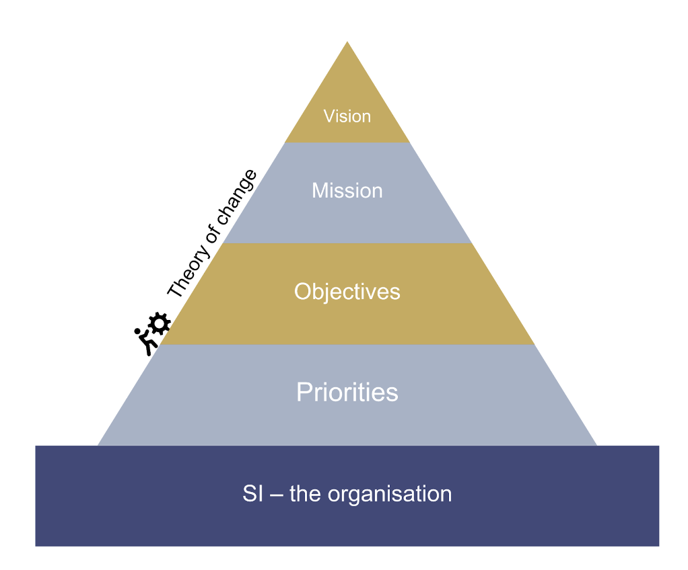
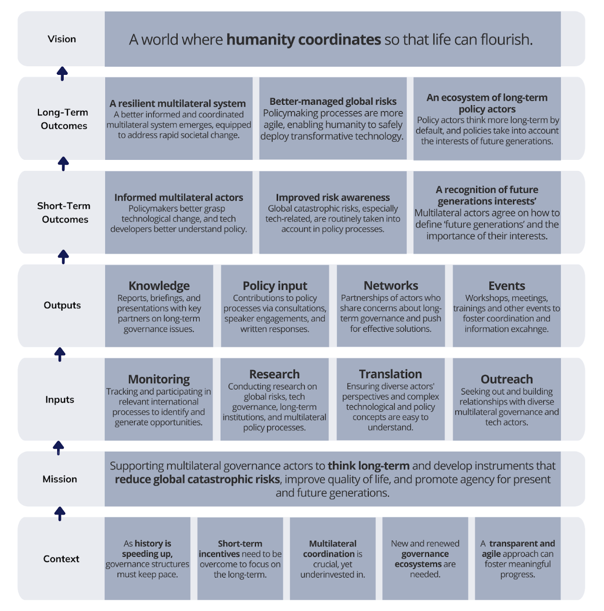

## The SI Strategy 

Our strategy and theory of change act as our organization's guiding star. The contents of them act as the foundation upon which we build our 2-3 year plans, monitor our progress, and reorient ourselves to achieve our organizational goals.

## Vision 

*Our vision outlines why we do what we do. It describes the long-term outcome we want to see from our work.*

**A world where humanity coordinates so that life can flourish.**

At SI we believe in the potential of human ingenuity and technology to create a future where life can thrive. But we fear the possibility of escalating harms or large-scale disaster if change is not well-governed. By promoting and enhancing coordination amongst global actors, we hope to contribute to long-term survival and happiness.

## Mission 

*Our mission specifies how we intend to achieve our vision. It describes the broad actions we will take and who we will work with.*

**Supporting multilateral governance actors to think long-term and develop instruments that reduce global catastrophic risks, improve quality of life, and promote agency for present and future generations.** 

SI collaborates closely with international organizations, national and local governments, NGOs, the private sector, and academia to address global catastrophic risks and safeguard the interests of present and future generations. Our mission involves translating technical knowledge into actionable policy advice and facilitating diverse networks of decision-makers to exchange ideas and best practices. By doing so, we bridge the gap between innovation and effective policymaking, contributing to the enhancement of multilateral governance processes.

Transparency and agility are the cornerstones of our approach, allowing our partners to place their trust in our ability to deliver timely, practical, and relevant support. With a focus on building lasting partnerships, we strive to pave the way for a more secure and sustainable future.

## Objectives

Our objectives clarify **what** we need to accomplish as we carry out our mission. They break down the broad actions of the mission into smaller and more specific stepping stones towards the achievement of our vision. 

### 1. Cultivate effective multilateralism 

Humanity is facing challenges that are increasingly global in scale and can only be effectively addressed by countries working together. Despite its shortcomings, as an inclusive platform to coordinate international action, the multilateral system is one of the only avenues for defining and pursuing shared solutions. Yet, it finds itself increasingly resource constrained, bogged down by complex processes and institutional structures that prevent it from adapting to a rapidly changing world. SI works with policy actors across different nodes of the multilateral system to find synergies, build capacity and improve coordination.

### 2. Enhance global technology governance 

New technologies carry immense potential and significant risks. Their responsible use is key for global well-being, sustainability, and empowering present and future generations. Effective technology governance is vital, yet the speed of technological change often outpaces policy adjustments. At SI, we aim to help policymakers keep up by translating and summarizing the latest science on technological risks and opportunities into concrete policy advice. By working with policymakers to influence the creation or evolution of governance structures, improve risk management, and foster input from all essential stakeholders, SI contributes to enhancing global technology governance to make it more responsive, agile and inclusive.

### 3. Shift policy focus towards the long-term 

The multilateral system is permeated by short-term incentives, leading to a frequent neglect of long-term issues. Many emerging risks, especially those from new technologies, cannot be tackled from a short-term perspective. To manage such risks, we need to change our approach to setting agendas, policies and priorities, and include greater foresight, uncertainty assessment, and tail-risk analysis into decision-making processes. SI endeavors to shift policy mindsets by raising awareness about the importance of long-term policy thinking and fostering demand for policies that consider future generations. Through such efforts, SI contributes to building a community of like-minded stakeholders who can expand the field of long-term governance and collaborate on research, policy input, and advocacy.

## Priorities

SI defines priorities as part of its strategy implementation plans, which cover a 2-3 year time-frame (see the SI Strategy Implementation Plan 2023-2025). These priorities are deduced from our vision, mission, and objectives and informed by the multilateral governance context and our organizational capabilities at the time. Individual projects undertaken by SI are mapped to the priorities, to ensure that they contribute to the implementation of the strategy.

## SI - The Organization

SI’s vision, mission, objectives and priorities rest upon a solid foundation, which is SI, the organization. Our people are at the heart of our capacity to deliver. They are guided by our [values](https://docs.google.com/document/d/1kj6tes9lmUNW-FFWEmkK3xX00qVhQ5Ogb-ToD_zZAfA/edit), and supported by our processes and infrastructure. Investing in solidifying and enriching our foundation is a constant and overarching objective behind the SI strategy. This means a consistent focus on excellence in operations; making sure we have the right skills and tools, maintaining motivation and providing room for growth, such that our efficiency and impact continue to increase over time.

## Theory of Change

Our theory of change expands on our mission to describe in more detail how the actions of SI will lead to the changes necessary for us to achieve our vision. It builds on five contextual factors, which lead to the implications that shape our mission. It then outlines how the inputs we provide will lead to outputs and, finally, to the short and long-term outcomes that can turn our vision into reality.

#### Context

SI has identified five contextual factors - and their implications - that underpin our Theory of Change.

**1. History is speeding up**

Globalization and accelerating technological change are fundamentally reshaping how we live, work, and interact with each other. However, as our world is becoming more complex, our governance systems – from local governments to multilateral institutions –  struggle to keep up with the pace and scale of change. Many are not designed to deal with the new realities we face. 

**→ Implication:** Governance structures need to evolve; to become more agile and responsive to match the rapid pace and complexity of the societal and technological change we are witnessing today. 

**2. Institutions are permeated by short-term incentives**

Governance systems continue to be permeated by short-term incentives, resulting in a neglect of long-term issues, and a neglect of future generations' interests. 

**→ Implication:** Long-term governance can serve as a valuable frame for countering short-term incentives by by encouraging actors to account for the long-term impacts of policy decisions, the interests of future generations, and the need to skillfully balance technological risks and benefits.

**3. Multilateral coordination is crucial, yet lacking**

As our world becomes more interconnected, actions frequently have consequences across national borders. As new risks with progressively more catastrophic potential arise, international coordination is increasingly necessary to manage them. Our current multilateral system is not fit to govern some of the most severe risks we face today. 

**→ Implication:** Despite its shortcomings, the multilateral system remains key for global coordination. It can host critical dialogues, lead global consensus-building, and direct local and regional decision-making. Greater effort should go towards strengthening the multilateral system to address the global challenges we face.

**4. Governance ecosystems are key for effective multilateral governance**

Governance ecosystems are sets of international instruments and institutions that oversee specific issues like global health or security, and encompass rules, norms, and decision-making processes. They guide action across levels of governance and can be effective mechanisms for fostering international coordination and adaptation. 

**→ Implication:** To foster effective multilateralism, effort should go to improving upon existing systems (such as the global health system, composed of organizations like the WHO, GAVI, UNAIDS, the Global Fund and more) by changing incentive structures to enhance coordination and foresight. In addition, multilateral actors should also work towards establishing new ecosystems to govern emerging disruptive technologies, such as artificial intelligence. 

**5. A practical, transparent and agile approach can foster progress**

To solve challenges in a rapidly changing environment, collaboration is key. Contributing to specific, relevant policy processes in an agile and transparent manner can build trust and traction with key stakeholders and is much more likely to produce effective results.

**→ Implication:** Transparency and agility should be the guiding principles behind the work of an effective organization working in the multilateral governance space. SI must therefore remain independent of pressures from governments, private actors, military groups, or political parties; communicate openly about its goals, activities, approaches and funding in order to cultivate trust; and maintain the ability to pivot easily to divert resources towards the most relevant and promising opportunities for impact.

#### Inputs

**Monitoring:** We monitor policy processes relevant to long-term governance issues to ensure a comprehensive understanding of all significant developments in the multilateral governance ecosystem, evaluating where and how inputs and interventions can be the most effective.

**Research:** We conduct research on long-term governance,; on risks and opportunities associated with rapid technological change, strategies for governing technological progress, and methods for including future generations' interests in policy-making processes. 

**Outreach:** We proactively conduct outreach to a diverse range of stakeholders to build new partnerships that yield insights, exchange best practices, promote coordination, and fill gaps in the long-term governance ecosystem.

**Translation:** We translate complex scientific, technological and policy concepts into accessible language, targeting information to specific audiences, with a focus on bridging the gap between science and technology experts and policy experts.

#### Outputs

**Knowledge:** We synthesize knowledge with key partners and institutions to produce politically and scientifically legitimate knowledge products on long-term governance issues, filling a critical gap in the multilateral system. 

**Policy input:** We contribute directly to policy processes via participation in and statements at high-level multilateral events, stakeholder consultations, and written responses to key multilateral processes and publications.

**Networks:** We build strong policy networks by fostering exchange between diverse stakeholders who share concerns about future generations, technology governance, and catastrophic risks.

**Events:** We host workshops, meetings, training programmes and other events related to specific policy processes, or to enable general community building and knowledge sharing about long-term governance. 

#### Short-Term Outcomes

**Multilateral governance actors are better informed and connected:** Through our work, multilateral governance actors receive a clearer grasp of scientific and technological progress, and science and technology actors gain a better understanding of policy-making processes. Both parties increase their knowledge about long-term governance topics and interface more frequently. As a result, policy makers in public and private institutions are better able to determine priorities and make recommendations grounded in crucial contextual insights. 

**Increased awareness of global catastrophic risks:** Through our work, there is greater awareness and understanding of the nature of global catastrophic risks and the need to govern them effectively, especially those risks stemming from emerging technologies. As a result, policymaking processes more routinely take into account these kinds of risks and appropriate risk governance approaches start to become institutionalized.

**Recognition of the needs of future generations in policymaking:** Through our work, an increasing number of multilateral governance actors agree on how to define ‘future generations’ and on the importance of safeguarding their interests. This leads them to counteract short-term incentives in the development of strategies, investments and policies.

#### Long-Term Outcomes

**A strong and resilient multilateral system:** Over time, multilateral institutions have seen improved coordination amongst various actors. Governance ecosystems have become more coherent and long-term focused, improving the the multilateral system's ability to address risks and accelerating societal changes. 

**Humanity benefits from technology, whilst minimizing risks:** Over time, policymaking processes have evolved to become highly agile, responsive and inclusive, enabling humanity to make the most of new technologies by putting in place effective governance structures to manage any risks. 

**Policy mindsets shift towards the long term:** Over time, policy actors have begun to think more long-term by default, and have adopted long-term governance principles in their decision-making processes. Coupled with a growing ecosystem of actors who care about long-term governance, more policies emerge that consider future generations’ interests and aim to ensure their well-being and agency.

## Example: Our Theory of Change applied to AI governance 

To illustrate our Theory of Change, we have applied it in the context of AI governance, as detailed below.

 `<td>\*\*Contextual factors\*\*`

`   </td>
   <td>Artificial Intelligence (AI) is set to fundamentally transform our society. However, the technology is developing rapidly and there is uncertainty as to how it will evolve. The pace of this technological development is already outstripping the capacity of governance structures to keep up. Most national regulatory efforts are trying to address proven harms and risks, but are struggling to account for potential future global shocks. Given the concentration of leading AI labs in a select few countries, and the anticipated impact of AI across the globe,  multilateral governance is imperative. At present however, there is no multilateral solution to handle AI. `

`   </td>
   <td>\*\*Implications\*\*`

`   </td>
   <td>New multilateral governance structures and mechanisms will need to be built in order to effectively leverage the opportunities AI brings, whilst minimizing the associated risks. These will have to be agile, forward-looking and highly technical to keep up with fast-paced technological developments and to address both the potential global catastrophic risks, as well as the opportunities that AI can bring.`

`   </td>
   <td>\*\*Mission\*\*`

`   </td>
   <td>SI will support multilateral actors in their efforts to develop governance mechanisms and institutions, disseminating knowledge and promoting long-term perspectives, to ensure that humanity can make the most of this technology, without losing control of it. `

`   </td>
   <td>\*\*Inputs\*\*`

`   </td>
   <td>SI will monitor international policy processes related to AI in order to identify windows of opportunity and promising instruments for multilateral AI governance. Background research on various national perspectives, policy developments and priorities related to AI will support engagement with key stakeholders (e.g. permanent missions, their ministers and the secretariats of international organization) and facilitation of interactions between them (e.g. including private AI labs). SI’s translation of the relevant technological developments into policy relevant information will contribute to successful AI governance.`

`   </td>
   <td>\*\*Outputs\*\*`

`   </td>
   <td>SI will synthesize information and produce knowledge products such as blog posts, briefing notes and reports in collaboration with member state-led organizations, explaining key issues in AI governance. Inputs will be made to the development of specific policy processes, such as the UN’s Global Digital Compact and the UN’s Multistakeholder Advisory Body on AI. Events will be organized to help build networks of key stakeholders, for example bringing together low- and middle-income countries to discuss their involvement in global AI governance.`

`   </td>
   <td>\*\*Short-term outcomes\*\*`

`   </td>
   <td>In the short-term, low- and middle-income countries will become more informed about AI governance issues and related global catastrophic risks, stepping-up their engagement and boosting otherwise blocked AI governance processes as a result. Better connections will be built between the major public and private sector actors, and the relevant AI labs will become more involved in multilateral governance discussions, improving the quality and accuracy of outcomes.`

`   </td>
   <td>\*\*Long-term outcomes\*\*`

`   </td>
   <td>In the long-term, an ecosystem of old and new institutions for AI governance will coordinate to ensure that risks are effectively managed and technological benefits are equally distributed. This will contribute to improving the well-being of current and future generations alike., thereby incrementally achieving our vision.`

`   </td>
   <td>\*\*Vision\*\*`

`   </td>
   <td>\*\*A world where humanity coordinates so that life can flourish\*\*`

`   </td>`