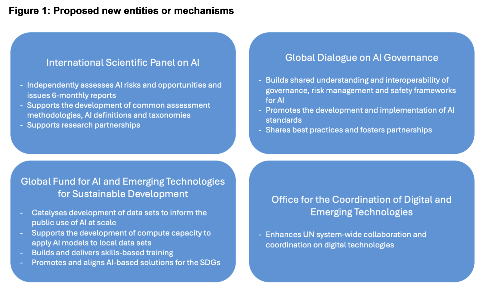
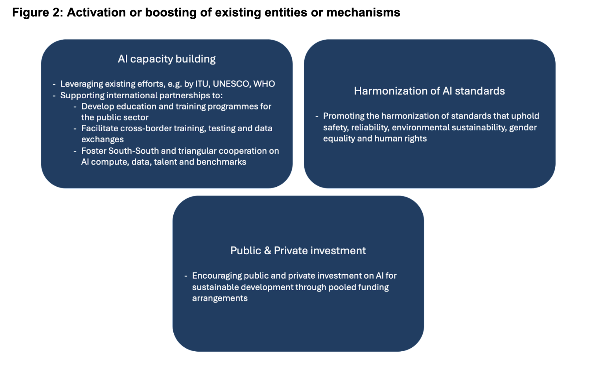
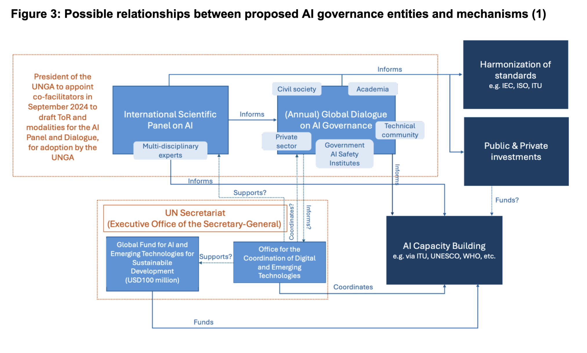
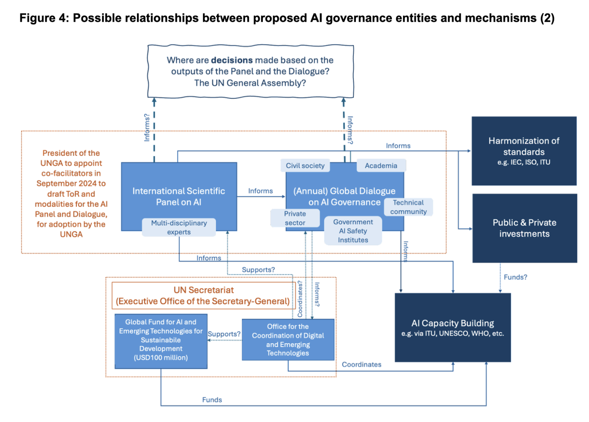

## Context

In September 2024, Member States of the United Nations are set to adopt the [Global Digital Compact (GDC)](https://www.un.org/techenvoy/global-digital-compact), an internationally negotiated text seeking to “outline shared principles for an open, free and secure digital future for all”, and to bolster international consensus on the governance of emerging technologies such as artificial intelligence (AI). On April 1st 2024, in preparation for the intergovernmental negotiations taking place in April/May 2024, the co-facilitators of the GDC process, H.E. Anna Karin Eneström of Sweden and H.E. Chola Milambo of Zambia, released a [Zero Draft](https://www.un.org/pga/78/2024/04/01/letter-from-president-general-assembly-on-global-digital-compact-zero-draft/).

Below, we provide a summary and a review of the GDC Zero Draft, concentrating on the sections relevant to AI. While this review has been written by our team at the Simon Institute for Longterm Governance (SI), the ideas and reflections contained herein have been heavily influenced and inspired by expert consultations we have conducted over the last few months, with 20+ AI governance experts from civil society, academia and industry.

In a nutshell, we see this Zero Draft as an ambitious start for Member States to build upon. Its current AI-related proposals are necessary, but not sufficient, to address the challenges we are facing. However, with some important additions and added clarity on certain issues, the GDC has the potential to shape the development of a promising multilateral regime complex for AI governance.

*You can download a PDF version of this response [here](https://drive.google.com/file/d/1Gx-ATad2Ui7eIMEzAO9IGsPs_qNq3rpH/view?usp=sharing).* 

*For a summary and discussion on other sections of the GDC Zero Draft, we recommend the [DiploFoundation's](https://www.diplomacy.edu/) analysis [here.](https://lnkd.in/dcbAYNmm)*

## An ambitious beginning

Encapsulating global hopes for our digital future in only fifteen pages is a commendable accomplishment and this Zero Draft can be considered an ambitious opening to the negotiation process. With the fast pace of AI development creating an urgency for multilateral governance, it is incredibly important that the GDC go beyond the establishment of principles (such as those agreed in the [UNGA resolution A/78/L.49](https://documents.un.org/doc/undoc/ltd/n24/065/92/pdf/n2406592.pdf?token=P0lcbOUwHZVQhvYEyB&fe=true)) to propose clear actions with concrete timelines. The Zero Draft does precisely that. It includes proposals to reinforce existing mechanisms and establish entirely new entities for the governance of AI and emerging technologies, covering most of the institutional functions identified by the  [Interim Report](https://www.un.org/sites/un2.un.org/files/un_ai_advisory_body_governing_ai_for_humanity_interim_report.pdf) of the Secretary-General’s High Level Advisory Body on AI. While further clarifications, refinements and additions will be needed, this text is poised to succeed in its initial mission to trigger much needed conversations on multilateral AI governance between Member States.

## 1. What the GDC Zero Draft is proposing for multilateral AI governance

Objective 5 of the Zero Draft is “Governing emerging technologies, including artificial intelligence, for humanity”. This section begins by making several key acknowledgements, which shape the commitments and actions that follow:

* Emerging technologies, including AI, **create both opportunities and risks for humanity,** and some of these are not widely understood. 
* AI offers huge potential for sustainable development, but this will not be realized automatically > **we need multilateral governance that is inclusive, multi-stakeholder, agile and coordinated.**
* **The UN has a central role to play** in supporting multilateral AI governance. 

The Zero Draft then elaborates a list of commitments and actions, which aim to lay the foundations for the multilateral governance of AI. These include the establishment of new entities or mechanisms alongside the activation or boosting of existing ones.

\
Although the Zero Draft does not detail the relationships between these entities and mechanisms, from the descriptions given we can imagine the following possible architecture and interactions (see Figure 3).

## 2. The strengths of the GDC Zero Draft’s AI proposals

Overall, the Zero Draft provides a very solid basis for negotiation because it covers a substantive set of topics and remains ambitious and precise in the commitments and actions it proposes. Its commitment in paragraph 8 “to pursue meaningful and measurable actions” sets the tone for this draft, and acknowledges the importance of setting targets and clear actions if we are serious about evaluating our progress on the implementation of the GDC.

When it comes to the section on AI and emerging technologies, here we find several ambitious proposals. These go far beyond principles to suggest the creation of new entities that could form the backbone for a multilateral regime complex for AI governance. While this suggestion to create new entities will require further elaboration and discussion, **it is an important acknowledgement that there are key governance gaps to be filled, and that existing structures are insufficient.** 

Nevertheless, the Zero Draft does not discount what already exists and, indeed, it puts a lot of emphasis on the need to “promote coordination and interoperability” across emerging AI governance frameworks and to “avoid overlap and fragmentation” of AI efforts. In particular, it clearly recognizes the role of the Internet Governance Forum ([IGF](https://www.simoninstitute.ch/blog/post/the-relevance-of-wsis-igf-for-international-ai-governance/)), the efforts of UN bodies such as the [ITU](https://www.itu.int/en/ITU-T/AI/Pages/default.aspx), [UNESCO](https://www.unesco.org/en/articles/recommendation-ethics-artificial-intelligence), [WHO](https://www.who.int/teams/digital-health-and-innovation/harnessing-artificial-intelligence-for-health#:~:text=WHO's%20vision%20is%20to%20foster,no%20one%20is%20left%20behind.), the Committee on Science and Technology for Development ([CSTD](https://unctad.org/topic/commission-on-science-and-technology-for-development)) and more, as well as the potential of the World Summit on the Information Society ([WSIS](https://www.itu.int/net4/wsis/forum/2024/en)) process to support the implementation of the GDC.

* Its proposal for the establishment of an **International Scientific Panel on AI** responds to calls that have been made by a wide range of stakeholders over the last few years (from heads of state, to tech industry leaders, to the High-Level Advisory Body on AI, and even the UN Secretary-General himself) for an ‘IPCC-type’ organization that can help to build scientific consensus and provide independent assessments on the opportunities and risks of AI. As frontier AI progresses apace, this knowledge-synthesis function will be crucial if policymakers are to keep up with the future directions and implications of AI technologies. 
* The proposal for an **Annual Global Dialogue on AI Governance** also reflects stakeholder input from throughout the informal consultations on the GDC, which repeatedly stressed the importance of taking a multi-stakeholder approach to global AI governance. Such an approach is crucial for the successful governance of AI, in particular, because of the concentration of technical knowledge in the private sector and the broad and significant effects these technologies will have across society at large. This Dialogue is perhaps inspired by the model of the IGF, which is widely considered to be a successful model of multi-stakeholder collaboration. Indeed, perhaps the intention is for this Global Dialogue on AI Governance to find a home within the IGF, if its mandate were to be revised as part of the WSIS+20 review in 2025? Whether this is desirable or not will be up for debate.
* The addition of a **Global Fund for AI and Emerging Technologies** is also a welcome - and potentially highly impactful - proposal. The allocation of a specific budget for AI within the UN system could catalyze action and spur coordination among international agencies, whilst also attracting more money (e.g. from private and philanthropic sources) into a system which is otherwise all too often paralyzed by a lack of available resources.
* Finally, the proposal to establish “a dedicated **office for coordinating digital and emerging technology** in the Secretariat” (para.61) is highly pragmatic and forward-looking. The cross-cutting nature of emerging technologies such as AI is already making coordination across the UN system a challenge (c.f. the need to set up an [interagency working group on AI](https://unsceb.org/sites/default/files/2021-07/IAWG-AI%20ToR.pdf)) and this challenge will only increase over time. Similarly to the Global Fund, we welcome the choice to focus the office on emerging technologies beyond AI, which is a way to build flexibility by design. However, from the current description, this office sounds like an institutionalization of the current Office of the Secretary-General’s Envoy on Technology, transforming it into a body similar to the UN Office for the Coordination of Humanitarian Affairs (OCHA). This direction prompts reflection on its intention and potential benefits, inviting discussion among Member States.

## What's missing from the GDC Zero Draft’s AI proposals

Although the Zero Draft establishes a good basis for AI governance, there are nevertheless a few key areas where it falls short - that is to say, **everything it is proposing is necessary for effective multilateral AI governance, but it is not sufficient.** 

At a high level, there is some work to be done to draw connections between the different objectives of the Zero Draft, many of which feed into each other. For example, there are important links between AI and data governance, but the Zero Draft does not address how data governance and AI governance frameworks could/should align. Another example is the link between AI and digital public infrastructure. While the cluster on “digital public goods and infrastructure” in Objective 1 recognizes the need to develop safe and secure open-source software, this is unfortunately not mentioned or referenced in Objective 5, although it is an important part of AI development and benefit-sharing.

The Zero Draft could also **benefit from added detail and clarity, especially with regard to the commitments around AI capacity building and benefit sharing.** The proposal on “increasing international partnerships on capacity-building and benefits-sharing” (para.49(d)) leaves important open questions, such as who would participate in these partnerships? What capacities and benefits are to be prioritized? Who would benefit from them, and how? Although we could infer that the proposed “Global Fund for AI and Emerging Technologies for Sustainable Development” (para.50(b)) would feed into such capacity-building efforts, the current draft does not provide any information about whether or how this Fund is linked to the other capacity building commitments it outlines. It also misses an opportunity to acknowledge the Global South’s significant contributions to the global AI supply chain (in terms of critical minerals and data labeling), and the environmental impact of AI model training further exacerbating climate change. Both go a long way toward justifying the need for increased benefit sharing.  

More importantly, however, there are three important omissions from this Zero Draft that could be highly consequential for global AI governance.

 First is the absence of an acknowledgement that AI is not a single technology. We feel that it is very important to explicitly acknowledge that there are different kinds of AI, offering different levels of opportunities and risks for humanity. While simpler ‘narrow’ AI systems can largely be regulated at national level through existing legal and regulatory frameworks, there is a governance gap where advanced AI systems are concerned, and this gap must also be filled at the multilateral level. This **differentiation between narrow and advanced AI** is what will allow us to achieve the balance between ensuring AI safety and fostering AI access and benefit-sharing. Our recommendation is thus to include in the GDC a definition and commitments that specifically refer to ‘advanced AI models’.

Second is the lack of any mention of **internationally agreed thresholds** to designate unacceptable levels of AI-related risk. We believe that it is essential for the international community to agree on ‘red lines’, or thresholds beyond which the development, deployment or use of AI systems may pose unacceptable systemic risks to society. We would like to see Objective 5 commit to establishing and updating these thresholds, ideally through the International Scientific Panel, which could build on [current work by international scientists](https://www.ft.com/content/375f4e2d-1f72-49c8-b212-0ab2a173b8cb). This would also help to ensure that AI developers are held accountable for their systems’ impact on global commons, and incentivized to ensure societal progress keeps pace with technological advances.

Third is the Zero Draft’s silence on the question of **where and how the international community will take decisions on the governance of emerging technologies, including AI.** One of the key challenges humanity is currently facing is that, at the multilateral level, there is no forum or dedicated mechanism for Member States and other key stakeholders to have in-depth and inclusive discussions, set priorities and take decisions on matters related to the research and development of emerging technologies such as AI. While the establishment of a Scientific Panel and a Global Dialogue would be huge steps forward for AI governance, if the outputs of these bodies do not clearly feed into some kind of decision-making apparatus, we will be faced with an outcome that is ‘all talk, no action’. Perhaps this could be solved by giving the multi-stakeholder Global Dialogue on AI Governance a mandate that includes the ability to make binding commitments and decisions? Or maybe an international convention on emerging technologies will be needed to fill this important gap? There are many possible solutions, but the GDC should at least point the way towards one. If it does not, this will be a huge missed opportunity for multilateral technology governance. 

## Our message to Member States in New York and Geneva

Digital and emerging technologies, including AI, have been reshaping our societies and economies for some time already. This transformation is both global in nature and increasingly rapid. Multilateral governance is urgently needed if humanity is to maximize benefits and minimize risks of these technologies, and this GDC is the opportunity for Member States to come together to agree clear commitments and actions. There will not be another opportunity in the short time-frame for action we are facing. We are hopeful that this Zero Draft, with its substantive and ambitious content, will provoke complex and fruitful discussions. We urge Member States, as negotiations commence, to not lose the high ambition this draft represents.