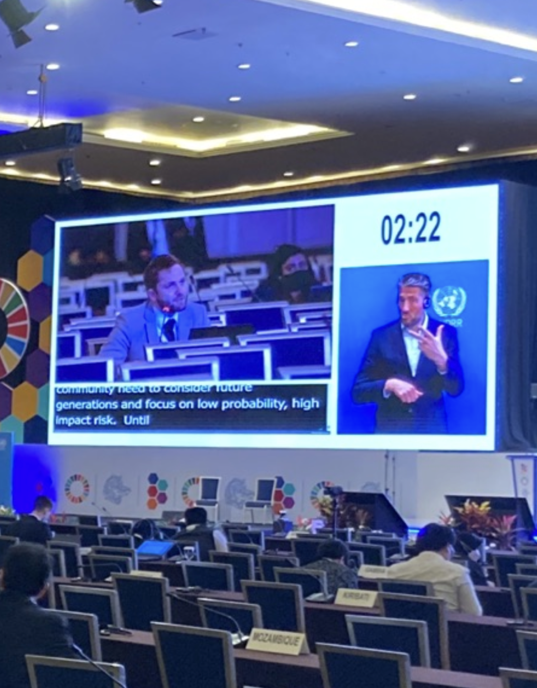

From May 23-28, SI’s CEO Maxime Stauffer attended the Global Platform on Disaster Risk Reduction (GPDRR) to speak on how the disaster risk field can better take into account global catastrophic risks, risks from emerging technology, and the impacts of risks on future generations.

The GDPRR, established at the request of the UN General Assembly, is the highest-profile forum for disaster risk professionals from across the world. It is run every two years by the UN Office for Disaster Risk Reduction, the UN Institution that serves as a hub for global cooperation on reducing disaster risk. This year’s Global Platform was attended by 3000 people in-person, with another 1500 online.

Max, who is part of the Swiss working group on disaster risk reduction, attended as a youth delegate of the Swiss Confederation. Over the 5 days of the conference he engaged in multiple discussions, contributed to official statements by the Swiss Confederation, and gave two official statements of his own. 

Max’s contributions to the Swiss official statements included the opening statement by the head of the Department of the Environment, Paul Steffen, and a statement on diversity in disaster risk reduction by the Swiss state secretary and head of the SDC. He introduced concepts that built on SI’s work surrounding global governance of catastrophic risks, the representation of future generations and the future-proofing of the multilateral system.

Max also directly gave two official statements. The first was on the need to consider low-probability, high-impact risks when expanding the Sendai framework (the internationally agreed-upon framework for disaster risk reduction). The second statement was on the need to comprehensively evaluate UN institutions based on their ability to respond to the wide range of catastrophic risks and their impact on future generations. 

The latter built on SI’s work on the long-term institutional fit framework (publication forthcoming), which proposes a method to evaluate the increasing number of future-oriented institutions coming into being post-COVID-19 pandemic, and ensure their effectiveness.

The statements were well-received by the director of the Sendai Framework’s mid-term review and by the Swiss disaster risk reduction coordinator, among many others. Currently, UNDRR focuses on natural, mostly regional hazards. We were therefore excited to see an increasing acknowledgement of the need to govern for emerging technological risks (such as from advances in synthetic biology or artificial intelligence) and their complex interactions with other risks. 

Building on this, SI will be continuing our collaboration with UNDRR, who have contracted SI to write a thematic study on existential risks and rapid technological change. We’re also working with UNDRR and the International Science Council to understand escalating hazards.

You can find the co-chairs’ summary of the GPDRR 2022 [here](https://www.undrr.org/publication/co-chairs-summary-bali-agenda-resilience-risk-resilience-towards-sustainable?Platform=&utm_term=0_0611eaa78d-baaa496bc3-466482765)

Below are some extracts from Max’s statements:

> My point is that **we - as a global community - need to consider future generations and low-probability, high-impact risks.** I'll give you three numbers. 10 billion additional people will be born by the end of this century. 85% of them will live in Asia and Africa. There is a 1 in a 6 chance of global, intergenerational collapse by the end of this century. Technological hazards are not only neglected by DRR efforts. They are also not represented in the SDGs. **We need to prioritize if we want to achieve success by 2030. We cannot do everything.**

> **Represent future generations within political instances.** And, here, I don't mean the youth. I mean unborn generations. We need mechanisms that allow us to think long-term. One of the many ways to do this is to give a second vote to parliamentarians, which they shall use in favour of future generations. **We need mechanisms for long-term thinking and planning.** Without them, we will face the wall of short-termism.

> Fit defines whether the UN adequately addresses the characteristics of the problems it needs to govern. Therefore:
>
> 1. We need **spatial fit** – the ability to deploy actions globally and foster coordination between local, national and international institutions. **Because global risks span boundaries.**
> 2. We need **temporal fit** – the ability to prevent shocks and act quickly if they manifest. Because existential risks need to be **prevented** and we need to be able to **react** to inevitable shocks.
> 3. We need **functional fit** – the ability to handle uncertainty and complexity. Because global risks are **interconnected and nonlinear**, and because we often need to act even though we don’t know what to do.
> 4. We need **representational fit** – the ability to represent current generations in their most diverse forms as well as future, unborn generations.
>
> In many ways, **the UN is not fit on all these dimensions. But the UN is one of the best set of institutions we have to foster global coordination and large-scale action.**

