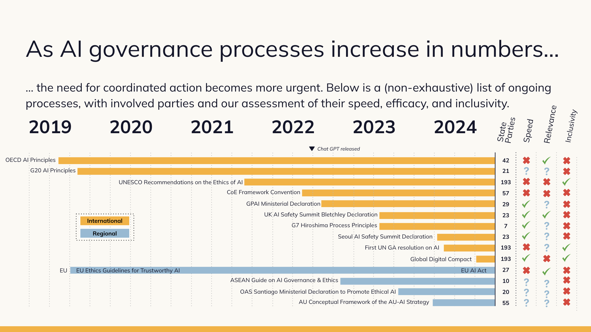

### Taking Stock

In 2021, the UN Secretary General published [Our Common Agenda (OCA)](https://www.un.org/en/common-agenda), a report outlining plans to revitalize the multilateral system and spotlight neglected issues that had grown in importance since the adoption of the 2015 Sustainable Development Goals, including pandemics, climate change, and AI. 

Since then, much of SI's work focused on ensuring that new multilateral agendas, narratives, and commitments emphasized future generations, acknowledged catastrophic and existential risks, and addressed forward-looking topics often overlooked in multilateral forums, particularly the advent and impacts of transformative AI.

To this end, we published the first-ever UN report on [Existential Risk and Rapid Technological Change](https://www.simoninstitute.ch/blog/post/existential-risk-and-rapid-technological-change-a-thematic-study-for-undrr/); delivered [a report](https://www.simoninstitute.ch/blog/post/hazards-with-escalation-potential-governing-the-drivers-of-global-and-existential-catastrophes/) on hazards with escalation potential with the UNDRR; published a [framework on future-proofing policies](https://www.simoninstitute.ch/blog/post/the-fair-framework-a-future-proofing-methodology/); held workshops on [foresight](https://www.simoninstitute.ch/blog/post/foresight-workshop-on-frontier-technologies/) and the future of the [multilateral system](https://www.simoninstitute.ch/blog/post/workshop-proceedings-future-proofing-the-multilateral-system/); offered policy input to the [Global Digital Compact](https://www.simoninstitute.ch/blog/post/response-to-the-zero-draft-of-the-global-digital-compact/) (GDC) & [Declaration of Future Generations](https://www.futureclimatecooperation.org/news/preparing-a-un-declaration-on-future-generations); provided private advising to national representatives on AI governance; and [hosted](https://www.simoninstitute.ch/blog/post/ai-governance-briefing-series-for-permanent-missions-to-the-un-in-geneva/) [capacity building](https://www.simoninstitute.ch/blog/post/training-course-on-ai-governance-for-un-missions-in-new-york/) [sessions](https://www.simoninstitute.ch/blog/post/briefing-series-on-frontier-ai-research-development-for-un-missions-in-new-york/) for diplomats on AI governance ahead of the negotiations of the GDC. 

Two weeks ago, on September 23rd, 2024, the UN crossed a significant milestone – with the [Summit of the Future](https://www.un.org/en/summit-of-the-future) taking place, and the [Pact of the Future](https://www.un.org/sites/un2.un.org/files/sotf-pact_for_the_future_adopted.pdf) and its two annexes (the Global Digital Compact and Declaration on Future Generations) receiving [endorsement](https://x.com/longtermgov/status/1839606387699052801). Perhaps most notably for AI Governance, commitments were made to establish a Global Dialogue and a Scientific Panel on AI.

Now, with the Summit behind, SI is taking stock of the multilateral system and planning next steps. Our primary focus for the foreseeable future, as it has been for the past year, will continue to be the advancement of multilateral AI governance.

While the Pact for the Future and Global Digital Compact include promising commitments on AI governance, there’s still a lot of work to do to ensure that these commitments are effectively realized, well-designed, widely participated in, and harmonized with other efforts around the globe. Moreover, multilateral progress on AI, in whichever fora, will hinge on the cooperation of key AI developer states, for which the UN is just one facilitator. 

In light of all this, we developed an updated set of plans for the next ~6-12 months, which you can read below. 

### Moving Ahead 

We believe that life's ability to flourish in the future will be strongly influenced, if not determined, by how transformative AI (TAI) is governed: AI has the potential to either [cause](https://www.nber.org/papers/w32980) existential catastrophe or enable unprecedented improvements in living standards. Common [needs and values](https://10billion.org/manifesto/) can guide effective multilateral cooperation in steering AI for the benefit of humanity.

Moving forward, several key assumptions underpin our plans: 

* We’re witnessing a transition to a [multipolar](https://foreignpolicy.com/2023/10/05/usa-china-multipolar-bipolar-unipolar/) international order and a uni-[technopolar](https://www.foreignaffairs.com/articles/world/ian-bremmer-big-tech-global-order) world order. 
* These transitions are [risky](https://academic.oup.com/pnasnexus/article/2/1/pgac289/6886577), fueling distrust between already rivalrous geopolitical actors and decreasing the odds of effective multilateral coordination. 
* Combined with other [obstacles to multilateralism](https://online.ucpress.edu/gp/article/4/1/68310/195239/Multilateralism-in-the-Twenty-First-Century), the likelihood of global catastrophe from rising inequality, war, tech accidents or misuse is increasing. 
* TAI [timelines](https://epochai.org/blog/literature-review-of-transformative-artificial-intelligence-timelines) too, remain uncertain, with predictions ranging from 3-10 years to 20-50 years. Our plans hold greater relevance on shorter timelines but build transferrable capacity should current trends plateau. 

As new AI governance initiatives emerge across policy fora, none of them will simultaneously satisfy requirements of speed, efficacy and inclusivity. We therefore believe that we need to leverage the comparative advantage of key fora to:

* Avoid irresponsible races toward transformative AI, especially between frontier AI companies and the US and China;
* Develop infrastructure for information sharing and consensus-building on the safety and representativeness of AI systems;
* Design inclusive processes that empower non-developer states to participate in AI governance, ensure equitable access to AI resources, and contribute to the design of standards and red-lines. 

To contribute to harmonizing activity across fora, we plan to:

1. Work with national representatives and UN Secretariats to support the development of an effective [International Scientific Panel on AI](https://www.un.org/sites/un2.un.org/files/sotf-pact_for_the_future_adopted.pdf).
2. Support the internationalization of UK governments seminal international AI safety efforts (AIS Summits, AISI network, State of the Science Report).
3. Work with the organizers and key stakeholders of the Paris AI Action Summit to harmonize governance efforts across regional, national, and international fora.
4. Collaborate with the technical AI governance community to improve its engagement with international processes.

We’ll continue assessing our plans throughout the next year. If you have any questions or comments about our work, you can get in touch [here](https://www.simoninstitute.ch/contact/).