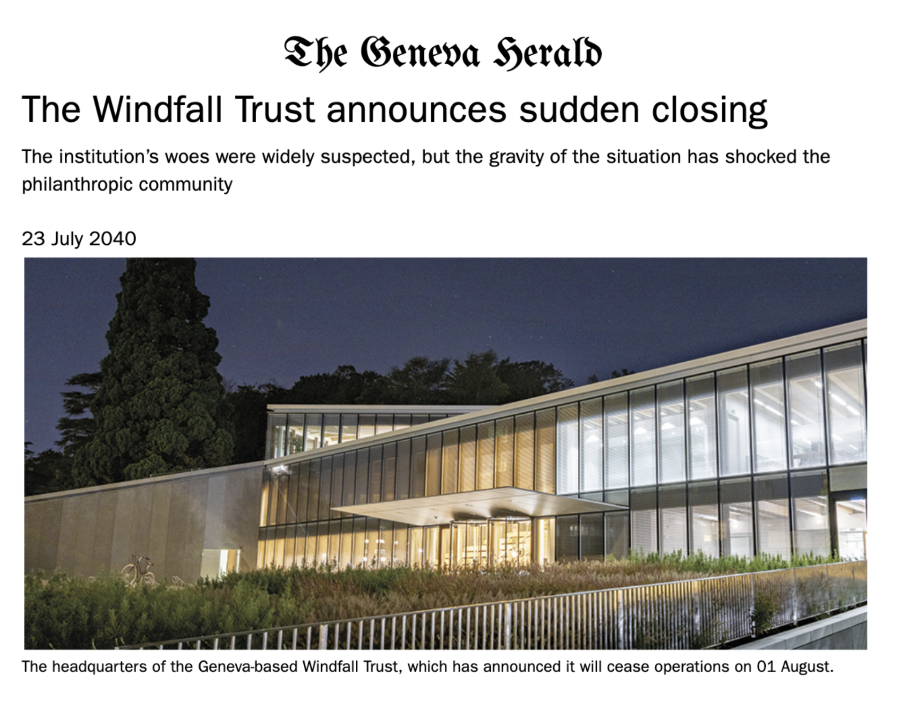

In the coming years, AI developments are expected to reap enormous economic gains. These gains will very likely be accrued by a small number of large technology companies situated in the Global North. If AI is truly to be developed and used for the good of all of humanity, we need to start thinking about how to equitably share AI’s benefits across the global population.

On July 23rd, 2024, [the Future of Life Institute](https://futureoflife.org/) (FLI) and the [Simon Institute for Longterm Governance](https://www.simoninstitute.ch/) (SI) co-hosted a workshop on [the Windfall Trust](https://futureoflife.org/project/the-windfall-trust/), an ambitious new initiative aimed at researching and establishing a robust international institution that could capture and redistribute economic gains from AI, possibly in the form of universal basic assets. One option for the financing mechanism behind this Trust could be [the Windfall Clause](https://www.fhi.ox.ac.uk/windfallclause/), wherein AI companies would legally pre-commit to sharing profits generated by their technology, if their profits exceed a predetermined threshold, such as a fraction of the world’s GDP. 

The workshop, held in Geneva, Switzerland, brought together leading experts from government, non-profits, and international organizations, and explored how the Windfall Trust could be funded, structured and governed. Participants first received background presentations on AI benefit sharing more broadly, by Claire Dennis, research scholar at the [Centre of Governance for AI](https://www.governance.ai/), and Sumaya Nur Adan, research affiliate at the [Oxford Martin AI Governance Initiative](https://www.oxfordmartin.ox.ac.uk/ai-governance), as well as an overview of the WindFall Trust initiative by Anna Yelizarova from the Future of Life Institute. 

During the background presentations, three main types of AI benefits were outlined: 

* Sharing AI resources: subsidizing compute access, conducting capacity building to ensure talent is dispersed across the globe, and open sourcing algorithms. 
* Sharing access to advanced AI systems: government subsidies for user access, or differential pricing schemes to enable broad access to AI systems. 
* Sharing the financial benefits generated by AI systems: via cash transfers, universal basic income, transfer of company shares/stocks, taxes, or an international fund. 

It was further highlighted that benefit-sharing as a concept is not particularly new, with numerous parallels existing in other domains, including but not limited to: 

* Sharing of nuclear technology for peaceful energy development via the International Atomic Energy Agency and Treaty on the Non-Proliferation of Nuclear Weapons;
* Sharing of genetic resources for biodiversity conservation via the Nagoya Protocol on Access and Benefit Sharing; 
* Sharing climate change technologies for global environmental protection via the United Nations Framework Convention on Climate Change. 

Following the background presentations, participants then engaged in two interactive segments. 

### Exercise 1: Windfall Trust Pre-mortem

In the first segment, participants were transported to the year 2040, where the Windfall Trust had announced its closure. They were tasked with conducting a pre-mortem analysis, and coming up with reasons for which the Windfall Trust had shut down by critiquing its weak points, including governance issues, incentive structures, funding mechanisms, and distribution problems. 

During the pre-mortem analysis, several critiques emerged, including: 

* Do private companies have sufficient incentive to engage in this kind of work? 
* If they were to join, would they face any repercussions for withdrawing from the initiative? How would they be prevented from simply reinvesting profits above a predetermined threshold to avoid funding obligations?
* Given the top-down approach, how can we be sure that countries in the Global South will want to participate in the initiative and accept the benefits? How will they be involved in the governance of the Trust, and in the process of distributing and selecting benefits? 
* What would happen if major global players (e.g. China) refused to participate in the initiative? How would the Windfall initiative ensure sufficient participation amidst broader geopolitical conflicts?
* How can we avoid race-to-the-bottom dynamics where individuals change their  socioeconomic status (e.g. stop working) to become eligible in the program?
* What would be done to prevent wide scale identity theft or other types of fraud or forgery to be eligible for benefits or receive them more than once? How would the latest AI advancements contribute to the creation of fake identities?
* Would universal basic income (UBI) truly address systemic, deep-rooted infrastructural or societal issues of power concentration, or might other approaches be more effective in addressing inequality? 

### Exercise 2: Rebuilding the Windfall Trust 

Following the pre-mortem, participants were transported back to the present day, and asked to redesign a successful AI benefit sharing entity, based on insights from the previous exercise. They were tasked with reimagining how such an entity might overcome obstacles brought up in the previous exercise, by addressing key issues in three areas: political and legal matters, funding and distribution of benefits, and governance. Suggestions included: 

* Lean in to paying out shares to recipients rather than lump sum payments to enable the development of additional benefits tied to shareholdership beyond monetary value;
* Focus on extreme poverty alleviation first to build trust with governments, and consider larger infrastructure projects to prevent power concentration before UBI initiatives;
* Ensure regional and geographical diversity on the governing board;
* Explore tax benefits for participating companies;
* Establish an external advisory body to prevent conflicts of interest and ensure transparency;
* Increase government involvement in enforcing fund donations by private firms;
* Involve local representatives in distribution areas and include local governments in the design process of distributing benefits;
* Run trial scenarios with specific governments.

*If you’re interested in learning more about the Windfall Trust initiative, sharing papers and resources with the team at FLI, or recommending potential advisers and leadership for the project, please don’t hesitate to reach out to [anna@futureoflife.org](mailto:anna@futureoflife.org).*