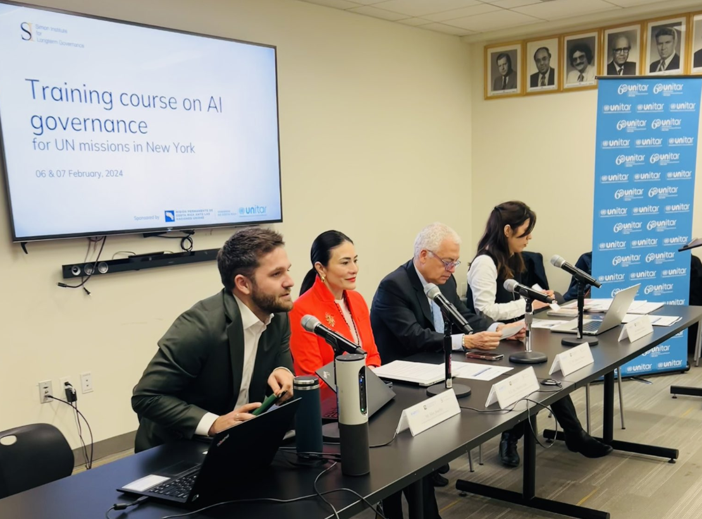

On February 6th and 7th 2024, the Simon Institute for Longterm Governance (SI) organized two full-day training courses on AI governance for Permanent Missions to the United Nations (UN) in New York, in collaboration with the Permanent Mission of Costa Rica and the United Nations Institute for Training and Research (UNITAR). The training courses welcomed 60 diplomats in total, 55% of which were from the Global South. 

The training courses sought to brief Member State representatives on the technical foundations of AI, AI’s opportunities and risks, and the role of the multilateral system in addressing AI governance. Diplomats strengthened their knowledge on AI issues, and debated them with their peers, in preparation for the upcoming negotiations of the UN’s Global Digital Compact (GDC).

Each course featured a mix of presentations, discussions, Q&As, and interactive segments, covering four categories: 

* Technical primer on AI
* AI opportunities and risks
* Overview of the current AI governance landscape 
* The role of the UN in AI governance 

The accompanying briefing note can be downloaded [here](https://drive.google.com/file/d/1htQkPBLSzxYGdNAVi8eSwGe4VDr_MGF5/view?usp=sharing). (Note: This document was updated in April 2024 to reflect more recent developments in AI governance.)

The first session, on AI’s technical foundations, covered the building blocks of AI (algorithms, data and computing power), the different stages AI development (R&D, foundation model deployment, and application development), and AI’s development trajectory (e.g. exponential progress via AI-enhanced human labor, leading to powerful specialized systems and potentially fully autonomous systems within this decade or century). It included a discussion and Q&A with Lewis Ho from Google DeepMind, who spoke about the private sector’s role in AI development, and answered questions on how data quality affects AI systems, where bias comes from and how to deal with it, risks of open-source AI models, and the difference between AI applications and foundation models. 

The second session explored AI’s opportunities and risks. It provided specific examples of opportunities, including enhanced healthcare via AI-driven diagnostic systems and improved disaster preparedness via AI-powered early warning systems; as well as some examples of risks, such as AI generated media fueling political instability and the potential loss of control over autonomous systems. Following the presentation, participants engaged in scenario-building exercises, where they were assigned scenarios based on different AI trajectories, and tasked with discussing the associated opportunities and risks.

The third session provided an overview of the current AI governance landscape, looking at factors that make AI difficult to govern, noteworthy national, regional and international AI governance initiatives, different policy levers for AI governance (e.g. production controls on computing power, fine-tuning and safety testing requirements for foundational models), and various proposals for new international institutions to govern AI (e.g. shared hardware and research à la CERN or an IPCC like body for international cooperation). The session ended with an interactive segment where participants were prompted to think about what kinds of institutional functions are needed to govern AI (e.g. knowledge production, monitoring, standards setting, etc.) 

The final session explored the role of the UN in governing AI, and provided an overview of existing AI-related UN bodies, processes, and initiatives, such as the High Level Advisory Body on AI, the Global Digital Compact (GDC), and the draft UN General Assembly Resolution on AI by the United States. The presenters explained how such processes could tangibly advance AI governance, highlighting for example, how the GDC could outline functional requirements for a multilateral AI governance regime, and potentially trigger subsequent mandates to fulfill these needs. The presentation was followed by a Q&A with Renata Dwan, Special Adviser to the Office of the Secretary General’s Envoy on Technology, and an interactive segment where participants outlined what they’d like to see achieved via the GDC. 

The training course received an average rating of 9.1 overall, with many noting that it helped boost their baseline understanding of AI’s technical foundations, and left them feeling more optimistic about making progress on AI governance. Several participants expressed interest in learning more about data governance, cyber security, and further exploring how AI could be used to help accelerate the 2030 Sustainable Development Goals (SDGs). 

Moving forward, SI plans to continue supporting member states with capacity building on AI governance, while also supporting efforts feeding into the GDC. For more information on the training course, or to inquire about further support on the subject, please don’t hesitate to reach out to Belinda Cleeland at [belinda@simoninstitute.ch](mailto:belinda@simoninstitute.ch).

